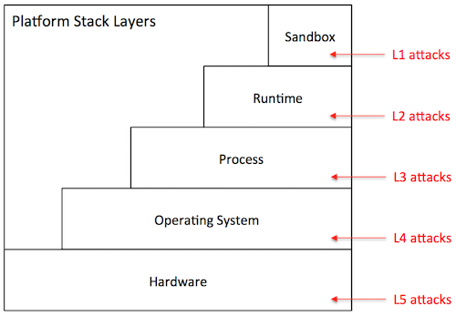
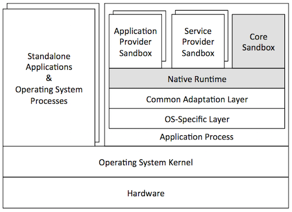
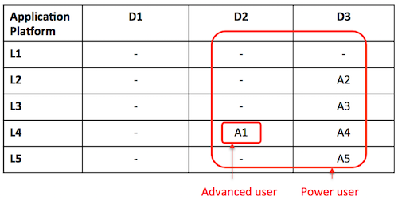

The Hyperty Runtime depends on a trusted computing base (TCB) that consists of several components: the Core Sandbox, the Native Runtime, and underlying Operating System and hardware. Subverting the Core Sandbox components may result in (1) incorrect decision and enforcement of policies by the PDP, (2) failure in routing messages through the Message Bus, (3) flawed registration and discovery of Hyperty and ProtoStubs by the Registry, and (4) incorrect maintenance of identities by the Identities Container. If the Native Runtime is compromised, so it will be the support for WebRTC stream communication between Hyperties. Since the Native Runtime implements the JavaScript engine (e.g., V8 [21]), tampering with the Native Runtime will undermine the execution of components implemented in JavaScript code, namely the components of the Core Sandbox (i.e., Policy Engine, Message Bus, Registry, Identities Container, and WebRTC engine) and client code instances (i.e., Hyperty Instances, ProtoStubs, Service Provider Policy Enforcers (SPPEs), and Applications). Lastly, compromising the Operating System or the hardware may result in incorrect behaviour of any of their overlying components, in particular the Native Runtime.

Next, we analyse the security properties of our system assuming that the trusted computing base is intact. Then, we assess the security vulnerabilities of the Hyperty Runtime when deployed on platforms featuring specific software and hardware configuration. In particular, we explore three platform configurations: *browser*, *standalone*, and *M2M standalone application*. We analyze each target platform under its specific threat model.

### Mitigated threats assuming an intact TCB

When the TCB is intact, our architecture ensures the correct isolation of client JavaScript code (i.e., Hyperties, ProtoStubs, SPPEs, and Applications). Isolation is enforced both between different client code instances and between client code instances and the environment (e.g., external applications, or OS resources). The Hyperty Runtime enforces access control decisions based on policy rules attached to Hyperty code. Such policies can regulate different aspects of the behaviour of a Hyperty: access to local resources (e.g., cookies, files, network, etc), routing, charging, and privacy restrictions. The system also ensures the authenticity of client code and the identity of the involved entities.

In the basic threat model, we assume that an attacker can serve arbitrary client code to the Hyperty Runtime. The attacker can impersonate a legitimate service provider and deliver malicious ProtoStub, Hyperty, or SPPE code. When instantiated on the Hyperty Runtime, this code may attempt to execute JavaScript instructions in order to access private data held (1) by other client code (including applications’), (2) by the Hyperty Runtime TCB, or (3) by the surrounding environment (e.g., the JavaScript Engine, or the Operating System). Malicious code may also aim to tamper with security-critical components, such as Hyperty policies or the policy enforcement engine, in order to escalate privileges. Finally, malicious code may launch denial of service attacks (e.g., by executing CPU intensive code). Below in this document, we expand on this threat model to consider potential vulnerabilities of our system when deployed on different environments. Next, we describe how our system defends against several classes of potential attacks.

#### T1: Unauthorized access by client code

The basic mechanism of our architecture to prevent unauthorized access by client code is sandboxing. Each Hyperty instance running in the system runs in its own sandbox. A sandbox defines a security perimeter for the Hyperty instance, preventing it from reading or writing the memory (or other resources) allocated to other Hyperty instances or by other components in the surrounding environment. An independent sandbox hosts the ProtoStub instance required by local Hyperty instances to communicate with external services. This sandbox will prevent potentially malicious ProtoSub code from unauthorized access to resources. To communicate outside the sandboxes, the runtime provides well defined interfaces: the Syncher, which is used by the Hyperty instance to communicate with the SPPE, and an API to communicate with the Message Bus. The SPPE and the PEE are responsible for enforcing the policy associated with the Hyperty instance.

The origin of the client code is validated. An origin is a combination of URI scheme, hostname, and port number. The origin can be asserted using certificates (e.g. using TLS) thus we only allow client code from secure origin.

Client code is subject to Same Origin Policy for direct interactions between client code instances. However, this can be relaxed using Cross Origin Resource Sharing (CORS) policy declarations. Pieces of client code from different origins can still communicate without CORS using the Message Bus API. Message exchange must be identified by the origin of senders and recipients. Subscription to messaging channels (where multiple client codes could publish messages) must be subject to authorization.

Note that, in our architecture, sandboxing is also used to secure the components of the Hyperty Runtime that are implemented in JavaScript, namely the components allocated in the Core Sandbox. The JavaScript engine implements both the client code sandboxes and the Core Sandbox.

#### T2: Policy subversion

Every Hyperty instance is constrained by a policy. A policy defines a set of rules, which can be of several types: access control rules, routing rules, charging usage rules, and privacy rules. Altogether, policy's rules are responsible for regulating, supervising, or restricting the operations that a Hyperty can perform, e.g., prevent access to a local file, enforce a predefined network route, or define the usage costs of a service. To prevent a malicious Hyperty instance (or ProtoSub) from subverting policy rules and escalate its privileges, the policy decision components and the policy repository are protected from the Hyperty instance by the Core Sandbox. As a result, policy integrity and enforcement are safe from malicious client code.

#### T3: Threats to client code authenticity

The authenticity of client code -- Application, Hyperty, ProtoStub, or SPPE -- can be compromised if at least one of two events has occurred without being detected before the code is loaded and instantiated into a sandbox: an attacker has modified the original code bytes (e.g., by embedding malware into a Hyperty code), or (ii) has modified the code identity. To prevent such attacks, client code's origin must be digitally signed and transmitted over a secure channel. Additionally the client code may be signed by its manufacturer. By checking these signatures before instantiating the Hyperty, ProtoStub, or SPPE code on the sandboxes and assuming that the cryptographic primitives are correctly implemented, the Hyperty Runtime can guarantee the integrity and identity of the code.

#### T4: Denial of service attacks

A malicious Hyperty instance, ProtoStub, or SPEE implementation can launch denial of service attacks by holding to specific resources, e.g., hogging the CPU by sitting on an infinite loop, or flooding the network with bogus messages. The JavaScript engine featuring the Hyperty Runtime prevents such attacks by placing a limit to the maximum utilization of a given service by a client code instance, for example by bounding the CPU cycles that a Hyperty instance is allowed to execute uninterrupted.

### Vulnerability assessment of the Hyperty Runtime

The Hyperty Runtime can effectively thwart the threats described in the previous section so long as the system's TCB remains intact. However, when deployed on a specific platform, the Hyperty Runtime may become vulnerable to some environment-specific security risks. In this section, we study the potential vulnerabilities of the TCB when deployed on three different platforms. But first, we describe our methodology to ensure a uniform vulnerability assessment of our system across platforms.

#### Methodology

Our basic methodology is based on a *vulnerability matrix*. A vulnerability matrix indicates representative practical attacks that can be carried out against the TCB on a given platform as a mean to compromising the security of the Hyperty Runtime. An attack is successful by achieving one or more goals described in the section above: permit unauthorized access by client code (T1), subvert Hyperty policies (T2), compromise the authenticity of client code (T3), and launch denial of service attacks (T4). We classify the attacks to the TCB along two dimensions: (1) the layer of the computer stack where the attack is directed to (e.g., the operating system), and (2) the difficulty level of the attack based on the technical skills and resources required by the adversary.

The figure above provides an example of a vulnerability matrix for a dummy platform. The content of each cell describes examples of attacks that can be launched to the TCB, e.g., "A1: inspection of JavaScript code through the browser", "A7: probing the system bus". Columns represent the difficulty level and rows the attack layer (both of them will be explained below). Intuitively, the vulnerability matrix allow us to grasp how exposed the TCB is to attacks: the lower the difficulty degree of the attacks is the more vulnerable the Hyperty Runtime will be when deployed on a particular target platform. Next, we describe the classification for attack layers and difficulty levels:

**Attack layers.** Attack layers can be classified in five types, ordered top-down, from the highest to the lowest layer of the computer stack, as shown in the figure below:

-	*Sandbox level (L1)*: The attacker has direct access to the sandbox environment, hence to the code and execution state of Hyperty instances. For example, on a browser platform, users typically have access to the JavaScript of a given page. This means that a malicious user can leverage that mechanism to tamper with the JavaScript code of local Hyperty instances.

-	*Runtime level (L2)*: The attacker has direct access to the code or execution state of the Hyperty Runtime. Depending on the specific exploit, he can mount attacks that disable defences against the attacks described in the previous section. On the browser, for example, a L2 attack can be achieved by installing a malicious browser extension that bypasses the policy enforcement mechanism of the Hyperty Runtime.

-	*Process level (L3)*: The attacker has access to the execution state of the process where the Hyperty Runtime is hosted. Just like the L2 attacks, this type of attack can result in catastrophic consequences. Examples of attacks performed at the process level include attaching a debugger to the Hyperty Runtime process and inspect its internal data structures, or dumping its memory state to disk by reading from /dev/mem.

-	*Operating system level (L4)*: The adversary has access to the execution state of the operating system, and therefore to the execution state of the Hyperty Runtime. Similarly to L2 and L3, L4 attacks can be catastrophic. An attack performed at this layer, for example, installs a rootkit to maintain a log of all operations performed by local Hyperty instances.

-	*Hardware level (L5)*: The adversary has physical access to the hardware of the platform and can launch simple attacks that do not involve tampering with the circuitry. Attacks in this category include, removal or inspection of the hard disk, probing the system bus in order to extract secrets from volatile memory, etc. An attack at this level may also include tampering with the silicon chips, perform side-channel attacks, etc. Such attacks require a high-level of expertise and committed resources. In theory, attacks performed at this level can reveal the entirety of the system state, including the operating systems. In practice, however, such attacks are more directed towards the extractions of specific secrets when L3 attacks or above are not possible.

**Difficulty level.** The difficulty level of an attack depends on several factors: the privileges owned by the adversary (e.g., user or superuser), the skills that are required (e.g., know how to run a debugger or tamper with silicon), and the necessary resources to carry out the attack (e.g., specific software exploits, memory probes, etc.). Based on these factors, we define three difficulty levels for a given attack:

-	*Easy (D1)*: The attack is easy to perform. The tools that are necessary to launch the attack are accessible, well documented, and simple to handle. Some examples of D0 attacks include: (i) on a browser platform, a malicious user leverages the browser interface to modify Hyperty code, (ii) on a constrained device, the device owner abuses superuser privileges to disable the policy enforcement mechanisms of the Hyperty Runtime.

-	*Medium (D2)*: The attack requires considerable skills and / or resources. It can be launched by mastering the tools presently available in the system (e.g., tools provided by the operating system, debuggers) or by installing new ones that can be found on the Internet (including malware or exploits). The attacker has limited skills or resources to discover new vulnerabilities or to develop exploits autonomously. Examples of such attacks include, attaching debuggers to extract in-memory secrets from the Hyperty Runtime, patch the Hyperty Runtime using exploit code published on the Web, etc.

-	*Hard (D3)*: The attack is very sophisticated. To mount the attack, the attacker must be able to develop its own exploit code, find new vulnerabilities in the system, and / or launch software hardware attacks. For example, finding bugs in a device driver’s code and write software exploits. The attacks performed at the deep hardware level are also considered hard to execute.

When drawing a vulnerability matrix, we define *attacker profiles*, which define sets of possible attacks that characterize possible attack agents in that particular platform. For example, for the browser platform, we define three profiles: regular user, advanced user, and power user. The regular user captures an average web user, which is able to launch attacks like "inspection of JavaScript code through the browser", but not "probing the system bus". We now present our vulnerability assessment for each of the target platforms.

#### Browser platform

The primary platform targeted by reTHINK is the browser. Browsers can be highly heterogeneous; we may be talking about desktops, laptops, or mobile devices featuring many different configurations with respect to: hardware architecture, operating system in use, installed software, and specific browser version and extensions. In spite of this diversity, a Hyperty-enabled browser will tend to follow the general architecture represented in the figure below.

In this architecture, the Hyperty Runtime (represented by the shaded components of the Figure) is deployed on an independent browser process. This process is in fact a "subprocess" of the browser that implements a sandboxing mechanism of its own (as in the Chrome browser). This mechanism is responsible for isolating the Hyperty Runtime from the browser's rendering engine. The JavaScript engine is responsible for the secure execution of JavaScript code inside individual sandboxes: (1) the Core Sandbox of the Hyperty Runtime, (2) service provider sandboxes for hosting Hyperty instances, ProtoStubs and SPPEs, and (3) application provider sandboxes for executing guest applications. As expected, the Hyperty Runtime process depends on the operating system, which in turn depends on the underlying hardware setup. Browser processes run side-by-side with other standalone application processes and operating system services.

From the security point of view, the threats to the TCB of the Hyperty Runtime are mainly caused by an adversarial user. To better characterize these threats, we define three attacker profiles and draw the vulnerability matrix as follows:

-	*Regular user*: This attacker profile captures the class of users with an average proficiency level in computing, but are willing to subvert the security properties of the system's TCB. The user's privileges allow for limited operations, such as: launch the browser, and run Hyperty-based applications. A regular user is expected to mount the following attacks:

	-	*A0*: Access and modify client JavaScript code through the browser interface.

-	*Advanced user*: This profile captures users with superuser privileges and some degree of skills and knowledge of the system. The user is aware of existing tools and techniques that can be leveraged to hack into the system's components, has access to exploits available on the Internet, and can handle auxiliary tools (e.g., debuggers, Unix advanced commands, etc.). The user can assemble and disassemble the basic hardware components of the system (e.g., plugging in / out the hard disk). For mobile devices, the user can root or jailbreak the platform by following instructions. Thus, considering this set of skills, in addition to A0, an advanced user can perform several other attacks at different stack layers such as these:

	-	*A1*: Compromise the runtime by installing a malicious browser extension.
	-	*A2*: Dump the memory contents of the process to disk.
	-	*A3*: Install a rootkit on the operating system that keeps track of Hyperty instances' communication.

-	*Power user*: This profile corresponds to highly skilled users, who have deep knowledge of the system and can launch sophisticated attacks. A user is able to investigate unknown vulnerabilities in the software (including in the Hyperty Runtime or in the OS) and develop specific software exploits. Moreover, the user has enough resources and tools to launch hardware attacks that involve tampering with silicon. A power user is able to mount not only the attacks described previously, but more sophisticated attacks on various layers of the stack:

	-	*A4*: Find and exploit a bug in the Hyperty Runtime.
	-	*A5*: Attach a debugger to the browser’s subprocess and inspect / modify its memory.
	-	*A6*: Build a device driver to continuously monitor the execution of Hyperty Instances.
	-	*A7*: Probe the system bus and extract private key material of Hyperty Instances.

**Vulnerability assessment:** As illustrated by the vulnerability matrix, the browser platform is vulnerable to a range of attacks. Some of these attacks can be mounted by regular users with relative ease. In addition, there are several ways for advanced users to successfully compromise the TCB by exploiting the system at different stack layers. As a result, we recommend that browser platforms are avoided for hosting client code which the local user has incentives to subvert. Examples of such code include: Hyperty instances restricted by specific usage charging policies, ProtoStubs that encode proprietary communication protocols, or Applications that access copyrighted digital data.

**Phase 1 implementation:** In the phase 1 implementation, we use native mechanisms provided by the browser API to ensure that the required sandboxing properties are satisfied. The core runtime components execute inside an iFrame. The iFrame implements the core sandbox by isolating the code of the core runtime from the main window in which the application javascript code is executed. This isolation mechanism prevents applications from having direct access to the memory address space of the core runtime. Communication between application and core runtime is possible only through a single and well defined entrypoint which allows them to exchange messages: method postMessage(). Hyperties and protoStub execute as independent Web Workers. Web Workers effectively isolate their internal states from each other and from the core runtime. The postMessage() method constitutes the only communication bridge between the these components. Based on this analysis, we conclude that the phase 1 implementation prototype satisfies the security properties that were specified for the browser runtime architecture.

#### Standalone platform

A variant of the browser platform is to deploy the Hyperty Runtime as a standalone application, for example to be executed as a mobile app on mobile devices such as smartphones or tablets. The Hyperty Runtime can also be packaged as a classical standalone application for desktop platforms running Linux or Windows. To allow for the development and maintenance of such applications, reTHINK will provide an SDK that will include APIs and platform specific libraries for adapting the Hyperty Runtime to the underlying operating system platform.

The figure above illustrates a general standalone platform tailored for Android mobile devices. Just like in the browser platform, the Hyperty Runtime is wrapped around a host process. The host process is responsible for (1) mediating the system calls issued by the Hyperty Runtime to the operating system and (2) providing a user interface to the Hyperty Runtime and client JavaScript applications (and Hyperties). In addition to the Hyperty Runtime, the host process application consists of: a platform-independent adaptation layer, and platform-specific libraries, e.g., for IO, storage, and memory management. In the example of the figure, the platform-specific libraries correspond to the Android API framework.

From the security point of view, standalone and browser platforms are quite similar; for that reason we adopt the same attacker profiles (regular user, advanced user, and power user). The main difference between architectures is twofold. First, the host application will prevent direct introspection of the JavaScript code running inside Hyperty Runtime sandboxes. As a result, the application architecture is able to mitigate simple attacks to the browser (A0 in the browser’s vulnerability matrix), raising the bar for regular users. Second, the host application will not support software extensions. This restriction prevents some advanced attacks to the runtime based on installation of malicious extension code, and to the browser process (see attacks A1 and A2, respectively, in the browser's vulnerability matrix). Next, we present the vulnerability matrix of the standalone platform and provide alternative attack examples.

-	*Advanced user*: An advanced user can compromise the entire system by launching attacks at the OS level:

	-	*A1*: Root the device and instrument the operating system in order to introspect Hyperty instances' sandboxes.

-	*Power user*: A power user can mount more sophisticated attacks on various layers of the stack:

	-	*A2*: Find and exploit a bug in the Hyperty Runtime.
	-	*A3*: Find a bug in the host application code and exploit it.
	-	*A4*: Monitor the execution of Hyperty Instances by rooting the device.
	-	*A5*: Hack the device hardware to extract sensitive Hyperty data from memory.

**Vulnerability assessment:** As highlighted by the vulnerability matrix, an Android-based standalone platform is more robust to attacks than the browser platform. This is mainly due to the fact the application architecture allows us to close security holes in the browser architecture that can hardly be thwarted without modifying the browser. Nevertheless, it is still possible to for an advanced user to compromise the system by rooting the device; the need to root the device will likely deter the regular users. Nevertheless, we recommend prudence in deploying client code that the local user has high incentives to subvert.

**Phase 1 implementation:** In the phase 1 implementation, we use Crosswalk to support standalone applications. Crosswalk is an HTML application runtime that allows us to execute the hyperty runtime as native mobile applications in Android and iOS devices without the need to install a full-blown browser. Mobile applications only need to be bundled with both Crosswalk webviews and the hyperty runtime code. Since a Crosswalk webview implements a Chromium-based runtime, it can seamlessly execute the hyperty runtime code that was implemented for the browser platform. Therefore, since we reuse the code of the browser phase 1 implementation, we can conclude that standalone applications will inherit similar security properties from browser applications.

#### M2M standalone platform

reTHINK also targets M2M communication use cases. For this reason, a standalone platform is necessary to run the Hyperty Runtime and guest client code. The targeted devices consist of Raspberry Pi and Beagle Boards. Such devices adopt an internal architecture very similar to the standalone platform: they can run Linux or even Android operating systems. We envision that these devices will run Linux-based operating systems. Essentially, the main difference between M2M and vanilla standalone application platform takes place at the implementation level. Therefore, our security analysis of the standalone platform is applicable to both instances. As Node.js was chosen as Native Runtime for the reTHINK M2M standalone application platform, attacks like server side injection caused by eval function are well known and there are best practices to avoid and protect the software components against such attacks. A valuable source of information that will be taken into account during the implementation is located at \[[108](https://nodesecurity.io/resources)].
