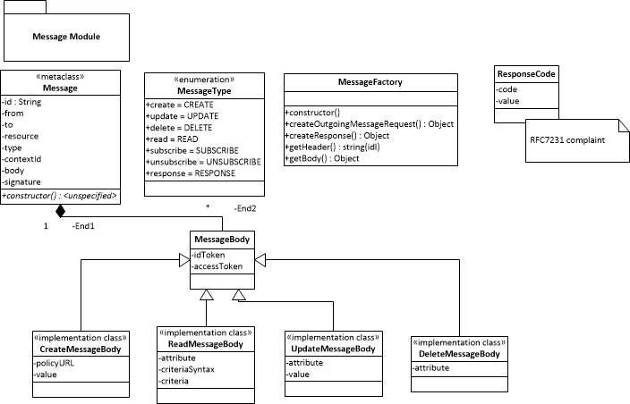

Service Framework
-----------------

### Overview

The reTHINK Service Framework provides a comprehensive set of application program interfaces (namly APIs) and JavaScript-based libraries to support the development of Hyperties.  As such, the Service Framework is agnostic with respect to the underlying messaging node, modular in design, and to the widest degree agnostic to devices and their operating systems, such as Android, iOS, Raspberry PI, Linux, or Windows. It features a comprehensive set of application program interfaces (APIs) and JavaScript libraries to facilitate the development of Hyperties within the reTHINK architecture.

As such, the reTHINK Service Framework enables the design of the Hyperty Runtime APIs to be developer-friendly, i.e., the latter only have to focus on a few core functionalities, namely:

-	MsgBUS.postMessage() that is used to post messages in order to communicate with other remote Hyperty Instances and with back-end reTHINK Support Services, 
-	Syncher API that is used to communicate through the Reporter-Observer communication pattern, and potentially
- the implementation of the hyperty init() function, used to activate the Hyperty Instance with required configuration parameters.

To accomplish this, the Hyperty Service Famework provides:

-	factory functionalities for creating and managing the reTHINK Messages and Data Objects
-	templates for creating Hyperty Data Objects for the basic specified Hyperty Types (Communication, Identity, Context)

This chapter updates the initial specificaiton of the reTHINK Service Framework as given in [D3.1].  For briefness, unaltered, valid descriptions are cross-referenced and updates and additions are given where appropriate. Those additions and updates focus on

* Service Framework Address and Message Factory
* Synchronizaiton among Hyperties (Syncer API)
* Discovery and Identity Manager library, and
* QoS interface and LHCB library.
* **xxxx list in summary updates here**
* **xxx**

*to be reviewed with links to existing documented framework libs. Missing Documentation for Discovery and IdentityManager lib*


### Methodology of Framework Development and Relation to other Work Packages

In order to determine functionality required by the service framework, Work Package Three analyzed:

-	Uses Cases as specified in WP1 Task1.1
-	Data Models as specified in WP2 Task 2.3
-	Interface Design as specified in WP2 Task 2.4

as summarized as follows.

#### Use Cases

D1.1 – “Use Cases and Sustainable Business Models” specified 15 user scenarios from which 5 have been selected as the main scenarios for the development of Hyperties in WP5, namely:

-	Daily life in a Smart City – Human-To-Human Communication
-	Daily Life In A Smart City – Individual Contextual Services
-	Hotel Guest Web Application* Apartment Rental Monitoring And Control Application
-	Smart Enterprise –Contextual Enriched Communication in Smart Enterprises

Details of these user scenarios can be found in D1.1. From the above user scenarios specific actors/roles, requirements and use cases where identified and specified. These functionalities include:

-	Communication Service: the Hyperty Runtime already provides an API for H2H and M2M communication. Developers will be able to use this service directly from the Hyperty Runtime API
-	Identity Service: a provider mechanism to access internal reTHNK IdP services or external IdPs (Google, Facebook, etc.)
-	Data Storage functions: for storing persistent data
-	Location functions: to access device specific context (e.g. GPS) to be used as context for different services
-	User Entity Management: to manage one or multiple user profiles*Notification service: for notifying triggered events

Functionaliy provided by the reTHINK Service Framework was then based on closing the gaps between existing functionality provided by open source JavaScript libraries and the complete functionality requirements coming from the use cases.

#### Data Models

In D2.2 Data models were specified from 3 different points of view - the service provider view, developer view and consumer view. For the Service Framework, focus will be laid only the developer view. The identified data models for the developer's perspective include the following:

**Hyperty Descriptor Model**: As described in D2.2, the Hyperty data model is used to model different types of Hyperty provided by the Service Provider. The Hyperty descriptor contains sets of data objects with information to the HypertyCatalogueURL, the type of Hyperty (communicator, identity or context), policies, constraints and configuration parameters. The Service Framework will provide JavaScript object templates specifying the Hyperty Descriptor Data Objects and extending them to create new Hyperty Types.

**User Identity Model**: This data model models a user entity within the reTHINK infrastructure. It has a unique identifier (UserUUIDURL) and multiple identifier Types (UserURL). The user entity is characterized by its profile (UserProfile) which may include information associated to the user : profile page URL, username, birthdate, picture, etc. To provide management functionalities to the developers to the reTHINK Identity management, the Hyperty Framework will need to interface with the Protocol Stub for Identity management.

**Context Model**: The context model is used to model different media types for representing simple sensors and device meta data which can be transmitted in a protocol such as CoAP or HTTP. The data model contains context information such as id, context type, time, tag and a list of context values which can be used in the M2M reTHINK uses cases. The Service Framework will provide factory functionalities for creating and managing these data objects.

**Communication Model**: The communication data model will be to model communications within the retHINK architecture for messaging and communicator Hyperties. The data model includes information for identifying a communication (id, owner, duration, etc.), the status of the communication (pending, open, closed, failed, paused), a list of participants (identity), the quality, the connection data object (webRTC connection) and message. The Service Framework should provide a set of functionalities for creation and management of the sessions. Some of these functionalities will be provided by the Hyperty Runtime. It is still to be determined to what abstraction level this should be made available to developers.

**Message Model** : This model specifies messages exchanged between Hyperties. It uses the Reporter-Observer communication pattern to create and synchronize object state changes amongst each other. The Hyperty Runtime includes this functionality which will be exposes to the developers through factory creation interfaces.

**Address Model** : Different address URL has been proposed for the reTHNK platform with respect to the different components. For example user:/// for Idp, hyperty-runtime:/// for the Hyperty Runtime and hyperty:/// for the Hyperty Instance. The Service Framework will provide factory classes for creation of different address URL types.

#### Interfaces

D2.2 and D2.3 specified network interfaces (Registry, Catalogue, Identity Management, Messaging service) for performing CRUD operations over various Data Objects. The Proto-on-the-fly and the protocol stubs from the different components could directly be used here without implementing extra functionalities to the Service Framework.

### Service Framework Updates

#### Service Framework Address and Message Factory

##### Address Resource Factory

The Address Resource Factory creates the different types of URLs required as specified [here](https://github.com/reTHINK-project/specs/tree/master/datamodel). It is compliant with the API described by [WHATWG](https://url.spec.whatwg.org/#api)

###### Address Data Model

All the attributes below are internally getter/setters functions. In the setter functions value validation will be included.

* ```href``` - It allows to get and set the complete URL string.
* ```scheme``` - It allows to get and set the scheme of the URL. In traditional URL it defines the protocol for which the URL was intended for. It can be any of the schemes defined in reTHINK: domain, hyperty, hyperty-catalogue, hyperty-runtime, comm, ctxt, acct, user-uuid and user. 
* ```username``` - It allows to get and set the username of the URL.
* ```password``` - It allows to get and set the password of the URL.
* ```host``` - It allows to get and set the host of the URL.
* ```hostname``` - It allows to get and set the hostname of the URL.
* ```port``` - It allows to get and set the port of the URL.
* ```pathname``` - It allows to get and set the pathname of the URL.
* ```search``` - It allows to get and set the query string of the URL.
* ```searchParams``` - It allows to get the query string of the URL according to the interface [URLSearchParams](https://url.spec.whatwg.org/#urlsearchparams)
* ```hash``` - It allows to get and set the fragment identifier of the URL.

##### Functions
* ```constructor(url, base)``` - Constructor function
* ```schemeValidation()``` - this function validates if the URL is syntactically compliant with any of the schemes defined for reTHINK. It will also validate standard schemes.

##### Static functions
* ```urlToASCII(domain)``` - This static function return the URL in ASCII code (to be discussed if it's necessary)
* ```urlToUnicode(domain)``` - This static function returns the URL in unicode (to be discussed if it's  necessary)


##### Message Resource Factory



####Class Message
The Message Class has following class attributes:
* ```id``` - the identifier to be used to associate Response messages to the initial request message
* ```type``` - from MessageType Enumeration class/variable
* ```contextID``` - GUID used to identify the context for example communication session
* ```from``` - URL of the Hyperty instance or assoiciated User
* ```to``` - one or more URLs of the recipeints
* ```resourceURL``` - the URL of the reTHINK Data Object resource associated with this message. Used for routing purposes.
* ```messageBody``` - from the MessageBody data object

####MessageType (Enumeration)
``` 
var MessageType = new enums.Enum("CREATE", "UPDATE", "DELETE", "READ", "SUBSCRIBE", "UNSUBSCRIBE", "RESPONSE");
```

####Class MessageBody
* ```idToken``` - optional attribute (JWT) for Identity assertion purpose
* ```accessToken``` -  optional attribute (JWT) for access control purpose

#####Class CreateMessageBody extends MessageBody
* ```policyURL``` - URL from where to download the access policy control
* ```value``` - JSON formatted data to create (TODO: has this been specified on any document so far?)
 
#####Class ReadMessageBody extends MessageBody
* ```attribute```- attribute in the object to be read
* ```value``` - value of the read attribute

#####Class DeleteMessageBody extends MessageBody
* ```attribute```- attribute in the object to be deleted

#####Class UpdateMessageBody extends MessageBody
* ```attribute```- attribute in the object to be modified
* ```value``` - new value of the attribute

#####Class ResponseMessageBody extends MessageBody
* ```code```- a response code complaint to HTTP response codes (RFC7231)
* ```value``` - data value in JSON format (used as value to read message requests)

#####Class ResponseCode
Enumeration of all response codes according to RFC7231

#### Class MessageFactory
The MessageFactory creates messages according to the [Message Data Model](https://github.com/reTHINK-project/specs/tree/master/datamodel) to be sent through the Runtime Message Bus. 

####Methods
* ```constructor(...)```
* ```createMessageRequest(URL.URLList to, MessageType type, Object extraHeaders, MessageBody body )```
* ```createDeleteMessageRequest(Message data)```
* ```createUpdateMessageRequest(Message data, String attribute, String value)```
* ```createReadMessageRequest(Message data, String attribute, String criteria, String criteriaSyntax)```
* ```createResponse(Message data, ResponseCode code)```
* ```getHeader(Message data, String key) returns String```
* ```getBody(Message data): returns JSON object```


#### Synchronizaiton among Hyperties (Syncer API)

* data: JSON data for the object

##### Event Handlers

**onResponse**

`onResponse(callback: (event: ReponseEvent) => void): void`

Setup the callback to process response notifications of the child creates. Responses to `DataObject.addChild`

* callback: callback function to receive events

**onChange**

`onChange(callback: (event: ChangeEvent) => void): void`

Setup the callback to process change events from the associated reporter child.

* callback: callback function to receive events

### Methods, Events and Handlers
Every object have methods, and event handlers to map to a pulling and push scheme.
Methods fire actions and Handlers react to actions and respond accordingly.
All events listed on the class diagram are intercepted in an event handler. From a functional perspective, methods like (accept, reject, wait, ...) are responses to an action. Since actions are represented by events, it makes sense that responses are directly related to them. Some rules:
* All events are inherited from the Event interface
* All handlers have method signature of "on\<classifier\>(..., callback)"

### SyncStatus

It is used to get and control the status of a DataObject (local, remote, reporter or observer). The interface is not yet implemented, documentation should be updated accordingly from the provided implementation behavior.


##### Properties
status: actual state based on the actions: pause, resume, stop, ...

##### Methods
pause: should pause the synchronization process, pause the mission of update messages between the reporter/observer link.
resume: resume the synchronization process from a pause action.
stop: probably the same as unsubscribe, so maybe this method is outdated.

### SyncSubscription

A reference to a remote observer/subscription, associated to a HypertyURL.

##### Properties
url: HypertyURL of the observer.


#### Discovery and Identity Manager library

#### QoS interface and LHCB library.
