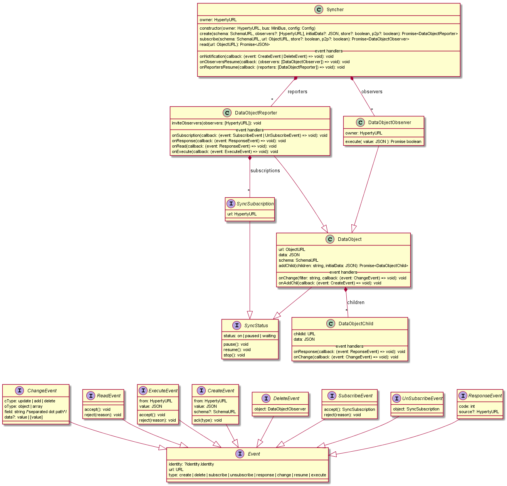

## Synchronizaiton among Hyperties (Syncer API)

*[source](https://github.com/reTHINK-project/dev-service-framework/blob/master/src/syncher/Syncher.js)*

The Syncher API provides data object synchronisation among Hyperties. The synchronised Data Objects are JSON data objects.
The Syncher API is depicted in the following diagram:

The Syncher is a singleton owned by a Hyperty Instance that uses it to communicate with other Hyperty instance through data synchronisation. The Syncher "owns" all DataObjects (DataObject class) used by its Hyperty Instance i.e. DataObject instances (creation, destruction) are managed by the Syncher and not by the Hyperty Instance. Each DataObject is addressed by a URL - ObjectURL - that is used by the Hyperty Messaging Framework to correctly route messages required to support the data synchronisation, via the MiniBUS component. When a new Data Object (Reporter or Observed) is created, the Syncher will add listeners in the MiniBus to receive messages targeting the ObjectURL. This means, the Syncher is the end-point associated to ObjectURL and not the Hyperty Instance.

According to the Reporter-Observer pattern, there are two types of DataObjects that each Syncher can manage:

DataObjectReporter - provides functions to handle DataObjects as a Reporter i.e. the data that is written in the object by the DataObject owner, is immediately propagated to all observers. It also handles requests from other Hyperty instance to subscribe (ie request to be an Observer) or to read the Data Object.

DataObjectObserver - provides functions to handle DataObjects as a Observer i.e. it handles a "copy" of the original Data Object which is updated as soon as the Reporter changes. Changes on the DataObject are notified to the Hyperty Instance Observers.

In addition, DataObjects can be SyncObjectParents with collections of DataObjectChild. Each collection is called DataObjectChildren. Either Reporter (DataObjectReporter) or Observers (DataObjectObserver) can create DataObjectChilds in a certain children collection (`addChild()` function).

### Syncher API

This is the main class that manages the creation of Data Objects. It is a singleton i.e. only one instance is available per Hyperty instance. It's the owner of all kind of data objects that can be synchronised by the Syncher including Reported Objects (DataObjectReporter) and Observed Objects (DataObjectObserver).

#### Properties

* owner: HypertyURL of Syncher's Hyperty instance owner

* observers: [DataObjectObserver] Array of Observed Objects

* reporters: [DataObjectReporter] Array of Reported Objects

#### Methods

**constructor**

`constructor(owner: HypertyURL, bus: MiniBus, config: Config)`

Syncher is created one per Hyperty. The parameters are basically the same as the ones that are passed to the Hyperty constructor.

* owner: HypertyURL of Syncher's Hyperty instance owner

* bus: MiniBus interface to send and receive message, using postMessage and addListener

* config: Configuration data. The only required field for now is the runtimeURL

**create**

`create(schema: SchemaURL, observers?: [HypertyURL], initialData: JSON, store: boolean): Promise<DataObjectReporter>`

This Method is used to create objects to be reported i.e. the Hyperty Instance plays the Reporter role. The following parameters are used:

* schema: Hyperty Catalogue URL address that can be used to retrieve the JSON-Schema describing the Data Object schema

* observers: array of Hyperty instances that are invited to be an observer of the new Data Object

* initialData: data that is used to initialise the new Data Object

* store (optional): if true the object is stored in the runtime and by a data backup service.

* return: Promise to a new Reporter. The reporter can be accepted or rejected by the PEP

**subscribe**

`subscribe(schema: SchemaURL, url: ObjectURL): Promise<DataObjectObserver>`

This Method is used to subscribe objects to be observed i.e. the Hyperty Instance plays the Observer role. The following parameters are used:

* schema: Hyperty Catalogue URL address that can be used to retrieve the JSON-Schema describing the Data Object schema

* url: the URL of the Data Object to be observed

* store (optional): if true the object is stored in the runtime and by a data backup service (if allowed by the reporter).

* return: Promise to a new observer if accepted. It's associated with the reporter.

**read**

`onChange(filter: string, callback: (event: ChangeEvent) => void): void`

Setup the callback to process change events from the associated reporter.

* filter: Filter that identifies the field (separated dot path). Accepts * at the end for a more unrestricted filtering.

* callback: callback function to receive events

#### Event Handlers

**onNotification**

`onNotification(callback: (event: CreateEvent | DeleteEvent) => void): void`

Setup the callback to process invitations to be an Observer or to be notified some existing DataObjectObserver was deleted.

* callback: callback function to receive events

**onObserversResume**

`onObserversResume(callback: (observers: [DataObjectObserver]) => void): void`

Setup the callback to process the Resume of Data Syncronisation for previously subscribed DataObjectObservers. Should be called when the syncher is instantiated by the Hyperty and Data Observer Objects to be resumed are found.

* callback: callback function to receive the event.

**onReportersResume**

`onReportersResume(callback: (reporters: [DataObjectReporter]) => void): void`

Setup the callback to process the Resume of Data Syncronisation for previously created DataObjectReporters. Should be called when the syncher is instantiated by the Hyperty and Data Reporter Objects to be resumed are found.

* callback: callback function to receive the event.

**onExecute**

`onExecute(callback: (event: ExecuteEvent) => void): void`

Setup the callback to process the request from an observer to execute a write action in the object. Useful for Context (IoT) Data Objects featuring actuator features.

* callback: callback function to receive the event.

### DataObjectChild
Child objects are returned from the `DataObject.addChild`.
DataObjectChild are created in relation to a pre-existent path on the parent object schema.
Child objects can be created from a Reporter or Observer and are shared between them.

##### Properties
* childId: URL address for a child, related to an ObjectURL

* data: JSON data for the object

##### Event Handlers

**onResponse**

`onResponse(callback: (event: ReponseEvent) => void): void`

Setup the callback to process response notifications of the child creates. Responses to `DataObject.addChild`

* callback: callback function to receive events

**onChange**

`onChange(callback: (event: ChangeEvent) => void): void`

Setup the callback to process change events from the associated reporter child.

* callback: callback function to receive events

##### Methods, Events and Handlers
Every object have methods, and event handlers to map to a pulling and push scheme.
Methods fire actions and Handlers react to actions and respond accordingly.
All events listed on the class diagram are intercepted in an event handler. From a functional perspective, methods like (accept, reject, wait, ...) are responses to an action. Since actions are represented by events, it makes sense that responses are directly related to them. Some rules:

* All events are inherited from the Event interface

* All handlers have method signature of "on\<classifier\>(..., callback)"

##### SyncStatus

It is used to get and control the status of a DataObject (local, remote, reporter or observer). The interface is not yet implemented, documentation should be updated accordingly from the provided implementation behavior.

**TODO** Maybe some kind of state machine diagram is needed to define better all the status, and the actions that activate the status transitions.

###### Properties
status: actual state based on the actions: pause, resume, stop, ...

###### Methods
pause: should pause the synchronization process, pause the mission of update messages between the reporter/observer link.

resume: resume the synchronization process from a pause action.

stop: probably the same as unsubscribe, so maybe this method is outdated.

##### SyncSubscription

A reference to a remote observer/subscription, associated to a HypertyURL.

###### Properties
url: HypertyURL of the observer.
