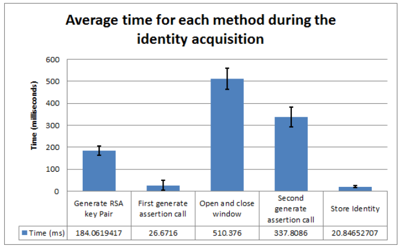
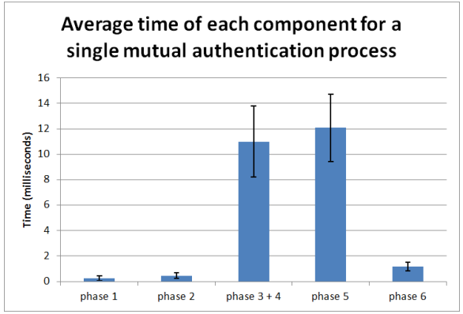
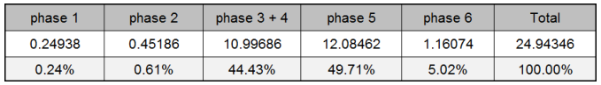
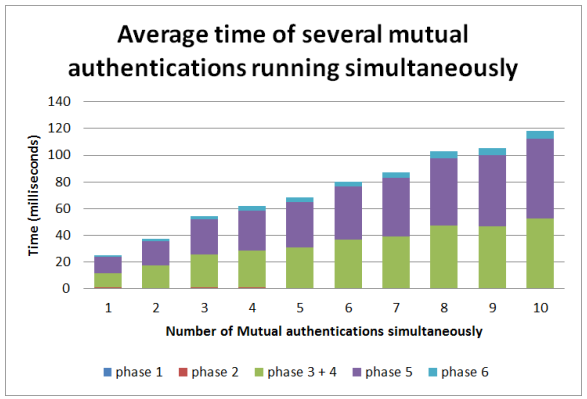
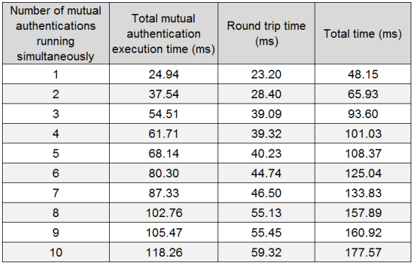
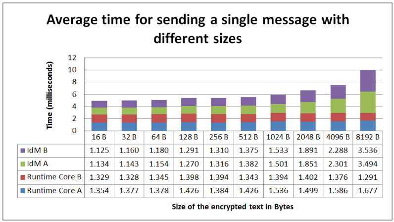
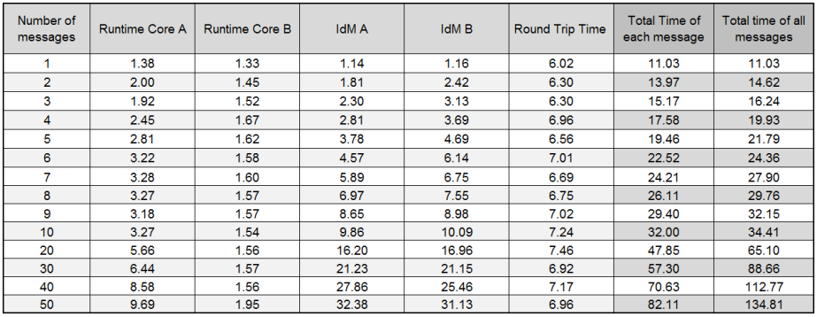
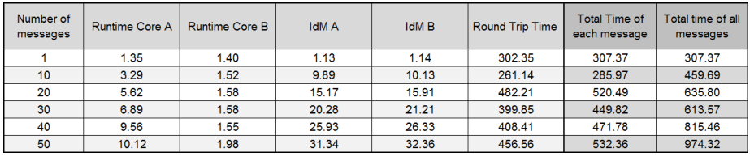
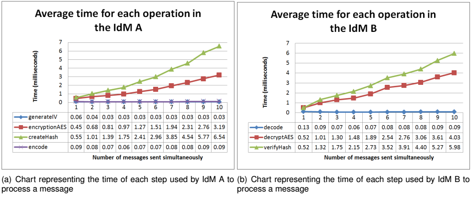

### IDModule non-functional Evaluation

In order to evaluate the performance of the developed ID Module, several tests were performed to evaluate the performance cost within the reTHINK framework. This evaluation covers the following features: identity acquisition from a user, the mutual authentication protocol and the secure communication using messages. Tests that required two users in different web browsers are demonstrated using the fictional users Alice and Bob, which are represented with the letter ‘A’ and ‘B’, respectively.

#### Methodology

For this evaluation, 1000 samples were taken for each test and averages of these samples were considered. The tests were performed on a computer with the following characteristics: CPU with an intel core i5-3210M running at 2.5 Ghz, 8GB of memory RAM and the Ubuntu 14.04 LTS operating system. The tests were performed on the components developed and integrated in the reTHINK framework.
To test the ID Module integrated in the reTHINK framework, scripts were made in JavaScript language to allow them to run in the web browser and to allow data to be retrieved. Since some scenarios requires two users to evaluate the component, for example the mutual authentication protocol, two web browsers were used, namely Chromium and Chrome. Each browser represents a single user running an instance of the reTHINK application. The decision to separate the users in different browsers comes from the need to ensure that each instance of the reTHINK application running in the browser has its own resources and is running isolated from each other. The Chromium and the Chrome web browsers were chosen given their structure similarity. To measure the times of each method or sub parts of the methods, the performance tool (https://www.w3.org/TR/hr-time-2/) which offers an API to obtain the current time in sub-millisecond resolution was used. To calculate the time each part takes, the 'performance.now()' function was called at the beginning of the method under test and called again at the end of the method to be tested. The measured time is the difference from the time obtained in the end minus the time obtained at the beginning.

#### User Authentication

The process of authenticating a user and obtaining his identity comprises several steps. Starting
by the generation of a public/private key pair for the RSA protocol, followed by the call to the IdP to
generate the assertion. In the first call a URL to authenticate is obtained. A second call for the generate
assertion method to actually obtain the identity assertion followed by the storage of this identity. The
times for these steps were measured to find the performance cost added to the reTHINK framework by
using the developed solution which is based on the WebRTC standard. For those tests, Google IdP
proxy, developed in this Thesis was used to obtain the identity. This test ignores the time the user takes
to select the identity via the GUI and the time the user takes to insert his credentials.

Figure 1 illustrates the time each component takes for the whole process of identity acquisition, showing an average of 1000 measures. These results suggest that, the methods with more impact on performance are the generation of the public/private key pair, the opening of a new window and the second call of the generate assertion method. The key generation time, taking about 200 ms, is relevant. However the main impact is in the opening of a new window, followed by the second call to the generate assertion. This second call includes the time the IdP takes to generate the assertion itself.

The developed mutual authentication requires the Identity Module to generate a public key to be asserted by the identity module. Taking into account that the average time needed for the identity acquisition is approximately 1080 milliseconds, and that the RSA key pair generation only corresponds to 17% of this time, it can be considered that the actual local processing is low. It can also be concluded that the methods causing the highest performance degradation on the user authentication, is the actual interaction with the IdP server, particularly by the Google endpoints. Further optimizations on the user authentication could be made by removing the generation of the keys and have a key pair previously generated, when no activity is being made on the reTHINK application, however this may have an impact on privacy issues.

 ##### Mutual authentication

 The mutual authentication is triggered whenever a user starts a communication with another user for the first time. This is essential so that both users are able to mutually authenticate each other before starting to exchange messages, thus preventing attacks, such as man-in-the-middle attack.

For the mutual authentication protocol, the time each phase of the protocol take was tested, in order to evaluate the more demanding phases and the impact were performed to the reTHINK framework. The execution of several mutual authentications simultaneously in order to determine the responsiveness of the Identity Module to more extreme cases. These tests were performed using two different browsers,
so they do not share the same resources provided by the browser. The tested protocol starts with a message sent from Alice to Bob and is divided in 6 phases, being the phase 1, 3, 4 and 6 on Alice’s device, and the phase 2 and 5 on Bob’s device.

The Figure 2 illustrates the average times that each phase of the mutual authentication protocol. As expected, the most demanding phases are phase 3 + 4 and phase 5. It is in these phases that the operations with asymmetric encryption used to validate the identities and to encrypt the secrets occur.

Table 1 illustrates the total time for the mutual authentication execution and the percentage in
regard to the total time. In phase 1 and 2 and 6, since there is no asymmetric cryptography the time they
take are minimal. It is in the phase 3 + 4 and phase 5 that the largest time-consuming phases can be
found, since it is where the heaviest asymmetric operations are made, such as asymmetric encryption
and digital signature. Those times can be disregarded when compared to the total time including the
round trip time (of about 48 milliseconds using a localhost Message Node).

To evaluate possible extreme usage scenarios for this protocol, the time required to perform multiple
the mutual authentication processes simultaneously was evaluated, as depicted in Figure 3. From the
values obtained it is possible to observe that the values grow linearly and do not introduce a bottleneck
to the reTHINK framework.

The above evaluation does not contemplate the round trip time. Since a public Message Node is
required, its time must also be taken into account. To evaluate the impact of this node in the reTHINK
framework a Message Node was defined to run in a localhost environment. Table 2 illustrates the
total time of the mutual authentication execution including the round trip time imposed by the messages
exchanged itself.

From this analysis, it is possible to conclude that the mutual authentication, in an ideal communication network, presents values almost unnoticeable to the common user (<200 milliseconds). Even in rare scenarios when 10 mutual authentication processes are executed. Since the execution time of the protocol is independent from the round trip time, the biggest bottleneck of this mutual authentication is in the communication time itself, where the communication latency can introduce a significant time to the conclusion of the mutual authentication process.

#### Secure communications

The ID Module is also responsible for providing secure communications in the messages exchanged between Hyperties, performing the encryption, decryption and integrity verification of those messages.
To perform the evaluations of the messages exchanged over the secure communication several tests were created that tried to replicate the sending of messages in different scenarios, from one Web Browser running an instance of the reTHINK application to another Web Browser also running instances of reTHINK, replicating the communication between two users. Both of reTHINK instances have a Hyperty running, representing a real case of two Hyperties communicating between them. The tests were performed by sending messages with different sizes, multiple messages simultaneously, and with different Message Nodes, one running in the test machine and the other running in the Altice Labs servers.

For each sent message the following operations were measured:
* Runtime Core A: Time it takes for the Alice’s Runtime Core to process the message created by a
Hyperty and send it, excluding the time taken by the IdM.
* Runtime Core B: Time it takes for the Bob’s Runtime Core to receive the message, process it and
delivery it to the Hyperty destination, excluding the time taken by the IdM.
* IdM A: Time Alice’s IdM takes to encrypt and authenticate the message.
* IdM B: Time Bob’s IdM takes to decrypt and to validate the received message.
* Round trip time: Travel time of the message, including the passage through the Message Node.

The performed evaluations consider the transmissions of several messages ranging from 16 Bytes to
8192 Bytes. It was not possible to send messages with more than 8192 Bytes of information due to
message size limitations of the Domain Registry. Figure 4 depicts the obtained results, excluding the
round trip time of the messages. It is possible to observe that both IdM A and B suffer a rather small
increment to the time required to process the messages with the increase of the message size. The
obtained values suggest, that the IdM does not introduce a bottleneck or a considerable decrease in
performance, taking into consideration the total time taken from both Runtime Core’s A and B to process
the messages.

To test the responsiveness of the IdM to several message transmission requests at the same time,
two tests were performed that send multiples messages simultaneously. One test ranging from 1 up
to 10 messages sequentially and another test testing multiples of 10 messages up to 50 messages.
Each message contains a 32 Bytes value to be handled by the IdM, simulating a conversation with the
exchange of short messages between users. The results obtained for both tests are depicted in Figures
5 and 6. These Figures depicts the average time in milliseconds that each component takes to send a single message when multiple messages are sent, including the round trip time. From these results it
is visible that the A and B IdM delay increases with a linear proportion, for up to 50 small messages sent
simultaneously. This linear increase is due to the fact that browsers do not possess concurrency, meaning they only use a single thread to run JavaScript code. Because the IdM methods are asynchronous,
it is possible for the IdM method to loses its thread processing time to another method, only regarding
the processor later on to conclude the task. The time the method is interrupted is accounted in the total
time the method takes.

When sending multiple messages simultaneously there is a difference between the latency and
the throughput, being the latency in this case the total time to send a single message takes and the throughput the total time to send all the messages. So, the obtained results are depicted in Table 3,
showing the individual time for each component, the total time for each message, the latency and the
total time of all messages. For this test a localhost Message Node was used, leading to similar round
trip times, independently of the number of messages sent. From the results it is possible to observe
that the latency increases with the increase of the messages sent simultaneously, resulting in a sub
linear increase. Despite this increase with number of messages sent simultaneously, the total delay is
relatively low, even for multiple messages.

To evaluate the impact of the Message Node, obtained the same tests were performed using a
public Message Node located in the Altice Labs servers. The values are depicted in Table 4. These
values suggest that the times for both Runtime Cores and A and B IdMs remains similar independently
of the Message Node used, where the biggest difference is in the round trip time, where in this last test
it expectedly takes more time.

From these results it is possible to conclude that the biggest bottleneck in the transmission of messages is the network latency, and that the performance of the IdM is only slightly affected when sending multiple messages at the same time.

Making a deeper analysis of the IdM times, the IdM times were decomposed on the following aspects: initial vector (IV) generation, encryption using AES, message authentication and encoding, for the IdM A and the opposite, for the IdM B. The values depicted in Figure 7 suggest that when sending multiple messages simultaneously the values that tend to increase are related to the encryption and hash computation. The IV generation and the encode/decode steps are barely noticeable. It is also possible to observe that both A and B IdM take approximately the same to process a message, for the same number of messages sent simultaneously.

From the obtained results for the secure communication using messages, it is possible to conclude
that the IdM methods do not increase exponentially, not even in the most extreme cases. This allows to
conclude that the system is able to perform with adequate metrics, independently of the number of
messages exchanged or the size of the messages. The biggest factor in the performance is the network
latency.
