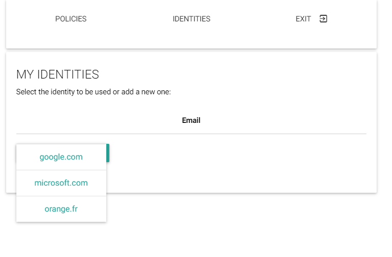
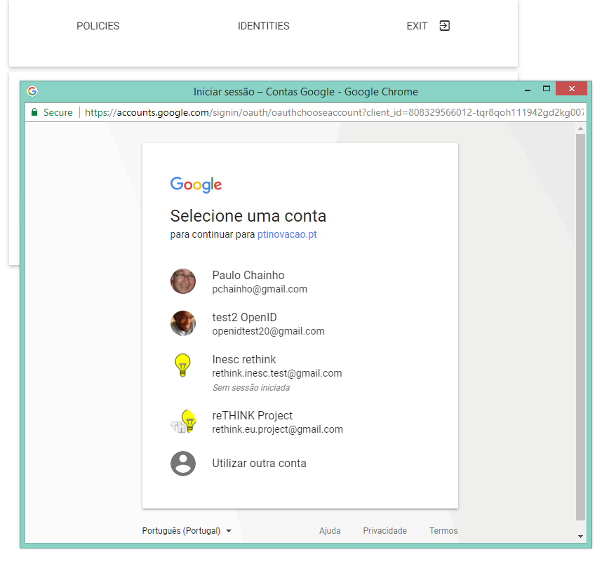
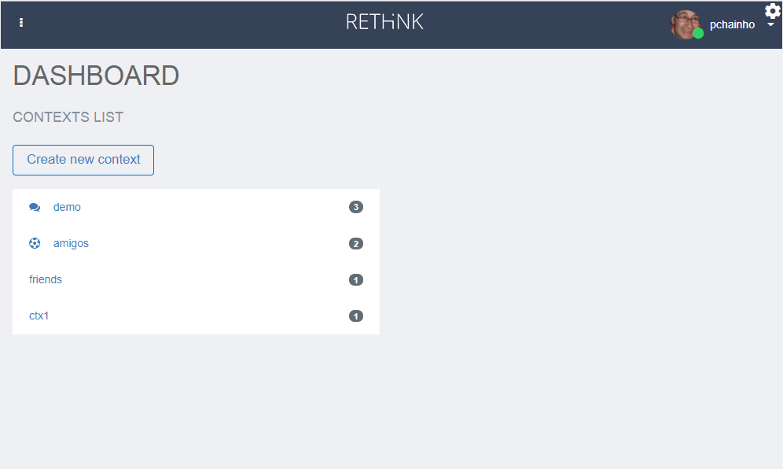
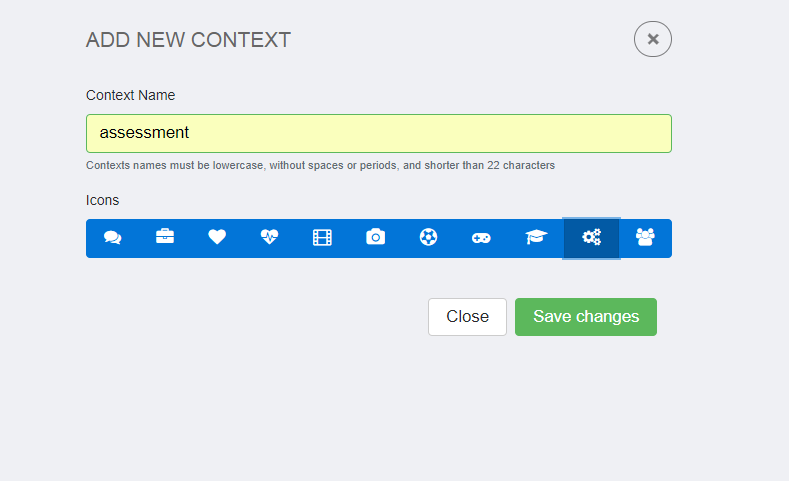
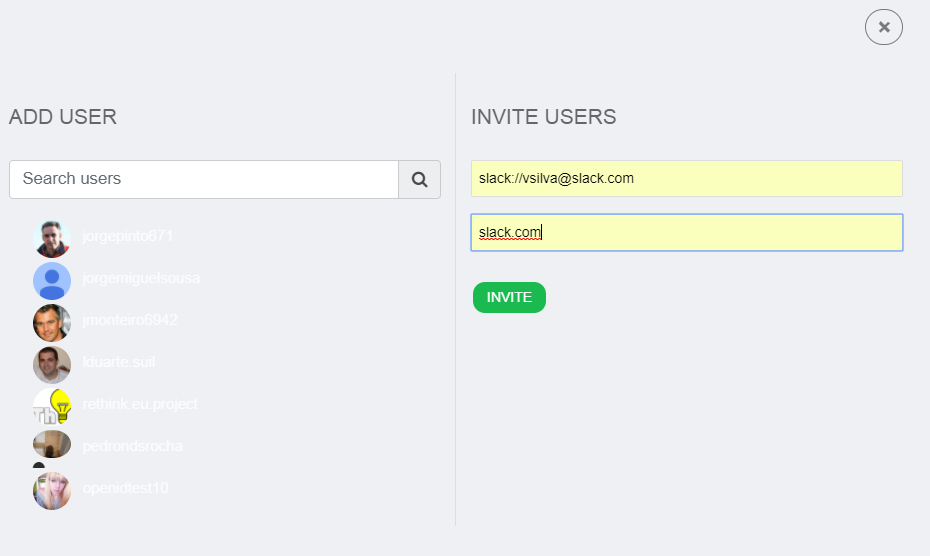
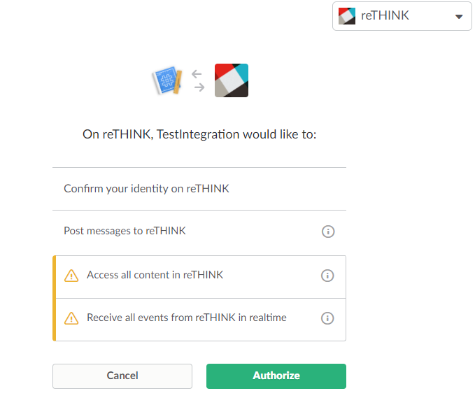
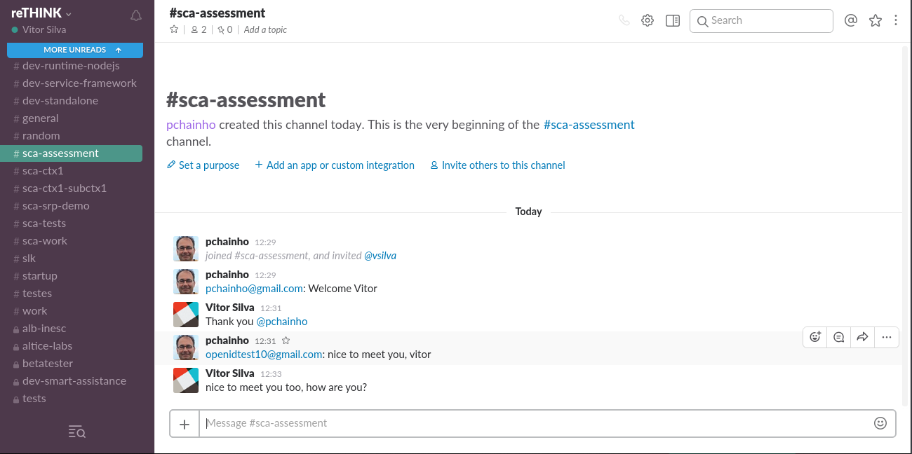

## Interoperability Evaluation

This documents provides guidelines to perform interoperability tests with reTHINK framework.
Before you go ahead with these tests it is recommended to be familiar with main reTHINK concepts enabling full interoperability among services without having to standardize protocols or service APIs, as described [here](https://rethink-project.github.io/Concepts).

The following tests allow to verify the usage of these concepts to support adhoc interoperability (i.e. interoperability between endpoints without previous knowledge) at different levels:

* Interoperability between two different reTHINK domains using different Messaging Nodes implementations including Protostubs but using the same Hyperty implementations.

* Interoperability between two different reTHINK domains using different Messaging Nodes implementations including Protostubs and different Hyperty implementations.

* Interoperability with legacy services, i.e., between one Hyperty and some non-reTHINK service.

For each of these tests, the latency will be measured for two scenarios:

1. when communication occurs for the first time between the two peers. In this situation, the protocol stub and the Idp Proxy has to be downloaded from the catalogue and deployed in the runtime.
1. it is not the first time the communication occurs between the two peers. In this situation, the protocol stub and the Idp Proxy is cached locally and does not have to be downloaded from the catalogue.

### Tests Setup

Interoperability tests can be performed partially locally or fully using back-end services like the ones provided by reTHINK testbeds. In both options two Google accounts are required.

#### Interoperability Tests Setup with remote domains

This is the simplest setup environment where no service has to be installed locally. Only standard Browsers are required. The usage of Chrome or Firefox are recommended.
The *hysmart* testbed from Altice Labs using the [vertx](https://github.com/reTHINK-project/dev-msg-node-vertx) Messaging Node implementation and the *Tlabs* using the [Matrix based Messaging Node](https://github.com/reTHINK-project/dev-msg-node-matrix), are used in these guidelines but any reTHINK compliant testbed can be used. Just follow the [Quick Installation Guide for reTHINK Framework](https://github.com/reTHINK-project/specs/blob/master/deployment/readme.md) to deploy your own reTHINK domain or testbed.

#### Interoperability Tests Setup with one `localhost` domain and one remote domain

In this setup environment, one of the domains is installed as `localhost`. This kind of setup environment is useful to test locally some developments before deploying in testbeds. It also gives you more freedom to decide on the implementation to be used including your own implementation, if that is the case.

**Localhost installation:**

1. Toolkit installation: follow the quick toolkit installation guide as provided [here]((https://github.com/reTHINK-project/dev-hyperty-toolkit#quick-start).
1. Domain Registry installation: follow the installation guide [here](https://github.com/reTHINK-project/dev-domain-registry/readme.md)
1. Messaging Node installation: select one of the following Messaging Nodes implementation and perform the provided installation procedures:

  * [VertX](https://github.com/reTHINK-project/dev-msg-node-vertx)
  * [Matrix](https://github.com/reTHINK-project/dev-msg-node-matrix)
  * [NodeJS](https://github.com/reTHINK-project/dev-msg-node-nodejs)
  * [no Matrix](https://github.com/reTHINK-project/dev-msg-node-nomatrix)  

### Cross-domain interoperability test with Group Chat

The Group Chat cross-domain interoperability test allows to test how two domains using different messaging communication protocols, i.e. using two different Messaging Nodes implementations can interoperate without having to agree in advance on the protocol to be used. Both domains use the same [Group Chat Manager Hyperty implementation](https://github.com/reTHINK-project/dev-hyperty/tree/develop/docs/group-chat-manager). Before you start performing this, pls ensure you have two valid Google accounts to be used.

Step 1: Open one browser window at `https://rethink-project.github.io/dev-smart-contextual-assistance-app/`. A window will be opened asking you to select the Identity Provider to be used.

Select Google and request to login,

and authenticate with your first Google account:

Give some time to load the runtime and Hyperties used by the Smart Contextual Application. When loaded you should see the following window:

Step 3: Open a second browser window in anonymous mode at `https://rethink-dev.tlabscloud.com/`. The procedure to select an IdP and login with your second Google account, should be performed. Again, give some time to load the runtime and Hyperties used by the Call Center Application. When loaded you should see the following window:

Step 4: Go back to the SCA App home opened window and click to create a new context:

Step 5: Click in the new created context and you will get into the new, but empty context environment. Click into "Add Contact" to start the party:

A new user interface will show up where you should provide information about the user you want to invite, in this case the one using the Call Center App. Insert the email address you have used for your second Google account and the `https://rethink.tlabscloud.com/` domain. Click invite.

Step 6: The new user should join the SCA new context and in the second window a chat window will be opened.

Step 7: Both users can exchange messages:

### Group Chat interoperability with Slack legacy service

The Group Chat interoperability with Slack legacy service test allows to test how one full reTHINK compliant domain can interoperate with another domain that is not reTHINK compliant without having to agree in advance on the protocol to be used. The Hyperty implementation is also agnostic of the legacy domains it can interoperate with.

This test will require having two Slack accounts in some team (https://slack.com/). It is assumed the SCA Context and the Call Center Group Chat created in the previous test, is still open.

Step 1: Open a third Browser window in some Slack team with your first Slack account.

Step 2: In your previously SCA Context window click to add a new participant. Insert the slack user account used in the previous step and its slack domain and click to invite.

Step 3: A window will be opened asking you to select the Slack team where the invited user is, your Slack identifier as well as asking you authorisation to use it.

Step 4: The Slack user should be added as the third participant to the Context. Now the three users can exchange messages among them. The user from the reTHINK SCA Application, chat with users from the reTHINK Call Center App and legacy Slack application:

The user from the reTHINK Call Center App, chat with users from reTHINK SCA Application and legacy Slack application:

The user from the legacy Slack application, chat with the reTHINK Call Center App user and with the reTHINK SCA Application user:

### WebRTC Audio and Video interoperability test

This test will show how two users using different Applications, different Hyperties from different domains, each one using different protocols, are able to call each other. The Call Center Application uses the [DTWebRTC Hyperty](https://github.com/reTHINK-project/dev-hyperty/tree/develop/docs/dtwebrtc) while the SCA uses the [Connector Hyperty](https://github.com/reTHINK-project/dev-hyperty/tree/develop/docs/connector).

It is assumed the SCA Context and the Call Center Group Chat created in the previous test, is still open.

Step 1: In your previously SCA Context window, select the contact using the Call Center Application. Click to call the Call Center user with video:

On the Call Center side an incoming call notification shows up with information about the SCA calling user:

Step 2: The Call Center user accepts the incoming call and a Video communication is established between the Call Center user:

and the SCA user:

### End-to-end Interoperability Performance evaluation

The Call Setup latency was measured for the call established between the DT Call Center Application hosted in Berlin, (Germany) and the SCA Application hosted in Aveiro (Portugal):

| **Test**                    | **Average Time (ms)**          | **Minimum Time (ms)** | **Maximum Time (ms)** |
| :---------------------------| :----------------------------: | :-------------------: | :-------------------: |
| Incoming Call Notification Time  |            501            |             599       |      536              |
| Call Setup Time                  |            940            |          1140         |     1052              |

We consider these results very encouraging. It should be highlighted the two services were hosted at different countries, each one using different Protostubs, which means during these procedures it was required to load and instantiate different Protostubs into the runtime.
