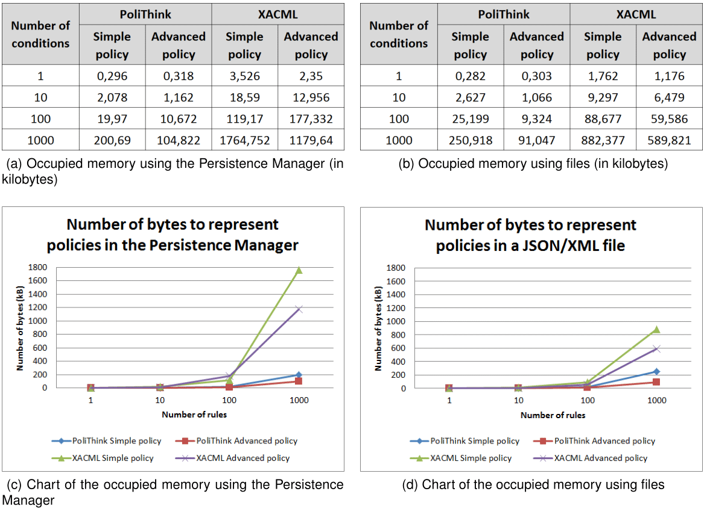
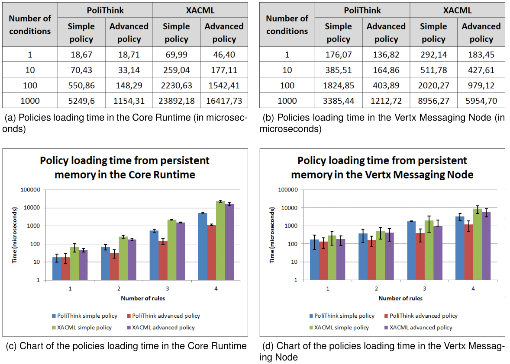
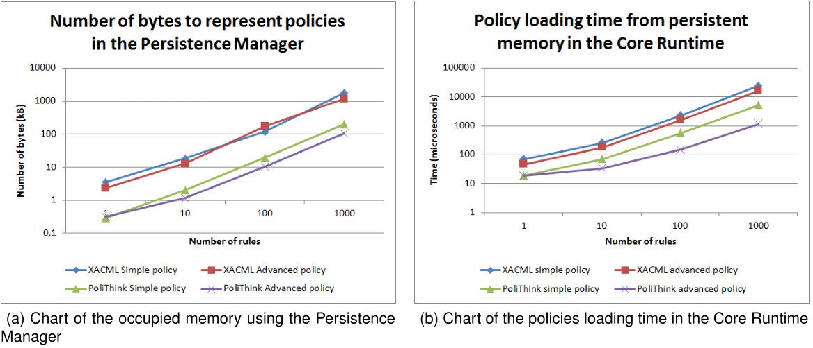

# Policy Engine Evaluation (INESC-ID)

This chapter presents the evaluation of the Policy Engine system (PoliTHINK). This chapter starts by describing the methodology ([section 1](#1-methodology)). Afterwords, this chapter described the memory usage measurements ([section 2](#2-memory-usage)) and the measures for the loading times of policies from both non-persistent memory and persistent memory ([section 3](#3-policy-loading-time)). Finally, this chapter also describes measures the evaluation time of policies ([section 4](#4-policy-evaluation-time)).

### 1. Methodology

Before presenting the obtained results of PoliTHINK evaluation, we will first present the methodology used in the execution of the tests. The time it takes to process a policy was separated in two stages: first, the loading time, second, the evaluation time. The tests to evaluate these variables will be performed for an increasing complexity of policies specified on our Policy Specification Language and also on XACML, the OASIS[1](#oasis) standard for policy specification. To test the loading time of XACML policies, we used an XML parser provided by JavaScript. To test the evaluation time of XACML policies, we built a specific program to read the XML DOM tree in order to extract the information necessary for the verification of the conditions represented in the policy. To improve the reliability of the tests, each experience was performed 11100 times, distributed by 11 runs of 1010 repetitions each. From the 11 runs, the first one was ignored, and for each run, the first 10 repetitions were also ignored. This way it was possible to discard the warm up periods and equalize the obtained results, further improving their reliability.

The complexity of a policy varies, on the one hand, with the number of rules, and on the other hand, with the size of the condition in a rule. The evaluation of each metric will be done for two groups of policies. The first group is characterized by policies composed of 1, 10, 100 and 1000 rules, each holding a simple condition to be examined. The second group is characterized by policies composed of one single rule, with an advanced condition that combines the result of 1, 10, 100 and 1000 simple conditions through logical operators. When the reTHINK application is started, the Policy Engine is not populated with the policies that users or service providers may have specified in previous sessions. To populate it, these policies are loaded from the persistent memory and stored in a local hash table, which is used to retrieve policies for message evaluation in that session. The processing time of the two ways of loading policies will be evaluated, as well as the processing time of policy evaluation. These tests were carried out in the two environments where the Policy Engine is integrated in: the Core Runtime and the Vertx Messaging Node. The tests were performed in a machine with the Intel Core i3-2367M CPU @ 1.40GHz, 4 GB of RAM, running on 64-bit Ubuntu 14.04 LTS.

<a name="oasis">1</a>: OASIS (Organization for the Advancement of Structured Information Standards) is a global organization that works on the development and adoption of standards for security, Internet of Things, and other areas.

### 2. Memory Usage

To evaluate the memory consumption, we take into account the fact that the Policy Engine can be integrated into two different environments: the Core Runtime and the Vertx Messaging Node. In both environments, policies can be stored both persistently and not persistently. The persistent way of storing policies in the Core Runtime is done through the Persistence Manager, which uses the Local Storage. It is a storage type that provides a means to store data with no expiration date within the user’s browser. The Vertx Messaging Node policies are stored in a file, which is loaded when the first message is sent to the Policy Engine for validation. To understand the impact of loading policies from the persistent memory when the system is booted, we must quantify how many bytes their representation requires. Figure 1 (below) presents the number of bytes occupied by policies with 1, 10, 100 and 1000 simple conditions and by policies with 1 rule composed of 1 advanced condition that combines 1, 10, 100 and 1000 simple conditions. In Figure 1 (a), it is presented the number of bytes used by the Persistence Manager to store each policy; Figure 1 (b) presents the measurements obtained for the policies stored in JSON/XML files. For better readability, Figure 1 (c) illustrates the measurements presented in Figure 1 (a) in a chart, and 1 (b) illustrates the measurements presented in Figure 1 (d).

**Figure 1: Persistent memory usage for policy representation**

Taking into account the results obtained for PoliTHINK and for XACML in both platforms, we observe that our solution is always more efficient than XACML in terms of memory usage. On average, a policy represented in PoliTHINK is 7,6 times more concise than XACML to specify the same behavior. Also, we can conclude that the number of bytes used to represent policies is always higher when using the Persistence Manager, as depicted in Figure 1. This is justified by the encoding used in the different environments. On the one hand, the Local Storage used by the Persistence Manager stores the policy as a JavaScript string, which uses UTF-16 encoding, i.e., each character is represented by 16-bit blocks. On the other hand, the default encoding of the Vertx Messaging Node is UTF-8, i.e., each character is represented by 8-bit blocks. For the most verbose policies, namely XACML, the measurements made for the file are approximately half of what was measured for the Local Storage, which clearly reflects the impact of the encoding on each platform. Adding to these observations, it should also be noted that representing the same conditions on a simple policy and on an advanced policy implies a big difference when it comes to the number of bytes needed. While a simple policy with X conditions requires the specification of X rules with fixed fields repeated X times, advanced policies only require that these fields are represented once for the rule holding the advanced condition. For this reason, the discrepancy between the occupied memory for simple and advanced policies increases rapidly for 1, 10, 100 and 1000 conditions.

### 3. Policy Loading Time

One of the requirements of PoliTHINK is that it provides an efficient solution in terms of the necessary time for loading and evaluating policies. Similarly to the previous section, this section presents the measurements obtained for the loading time of simple and advanced policies with an increasing number of rules and conditions. Next, we will present the time measurements obtained when loading policies
from persistent memory and from the local hash table, starting with the former.

#### 3.1. Loading Time from Persistent Memory

The policies loading time from persistent memory is measured differently in both environments where the Policy Engine is integrated. For the Core Runtime, policies are stored using the Persistence Manager; for the Vertx Messaging Node, policies are stored in a text file. To measure the loading time in the Core Runtime, a timer is set using a library that generates the microseconds before the policy is loaded from the Persistence Manager, and a second timer is set right after that request is fulfilled. Loading a policy with a given key from the Persistence Manager consists of requesting the Local Storage to retrieve the value that corresponds to the policy key, which is then parsed to JSON format. Subtracting the two timers gives the time it takes for the policy to be loaded from the Persistence Manager. To measure the loading time in the Vertx Messaging Node, a timer is set before reading the file, which consists on instantiating a FileInputStream and a BufferedReader given the path to the JSON/XML file holding the policy, and then reading the file line by line, concatenating the contents in a string. The measurements obtained for the policies loading time are presented in Figure 2 (below), where Figure 2 (a) shows the loading time of policies when using the Persistence Manager, and Figure 2 (b) presents the measurements obtained for the same policies but when they are loaded from JSON/XML files. Figure 2 (c) illustrates the measurements presented in Figure 2 (a), and 2 (b) illustrates the measurements presented in Figure 2 (d).

**Figure 2: Policies loading time from persistent memory**

Taking into account the results obtained for PoliTHINK and for XACML in both platforms, we observe that our solution is always more efficient than XACML in terms of loading time from persistent memory. The policy loading time is closely linked with the corresponding memory usage, i.e., as the policies' complexity implies a higher number of bytes to represent them, the more time it is needed to load them. This relationship is illustrated in Figure 3 (below), where Figure 3 (a) illustrates the memory usage for policies in the Core Runtime and 3 (b) illustrates the policy loading time in the same environment. In this figure it is possible to clearly observe the trend of the policies loading time from persistent memory, which follows the trend of memory usage in the Persistence Manager.

**Figure 3: Memory usage and policies loading time comparison**

When the policies are loaded from the persistent memory to the Policy Engine, they are stored in a local hash table. This hash table is then accessed for each message if there is an active user policy (in the Core Runtime), or if there is an applicable service. Next, we present the measurements obtained when loading the policies from the local hash table.

#### 3.2. Loading Time from Local Hash Table

A hash table is a data structure that can map keys to values through a hash function in constant time. To avoid the overhead introduced by loading the policies from the persistent memory for each message that requires policy evaluation, the Policy Engine uses a hash table to store the policies that correspond to a given policy key. Therefore, when a message is intercepted by the Policy Engine, the policy to apply is retrieved from the hash table instead of from the persistent memory, which greatly improves the loading time. To examine the performance of loading the policies from the hash table, a test similar to the one performed in the previous section was carried out: a timer was set before accessing the hash table, and a second timer was set after reading the policy that corresponds to a given key. Subtracting the two timers gives the time it takes for the policy to be loaded from the non-persistent memory. The measurements obtained for this test are presented in Figure 4 (below), where Figure 4 (a) shows the loading time of policies in the Core Runtime, and Figure 4 (b) shows the loading time of policies in the Vertx Messaging Node. The charts presented in Figure 4 (c) and (d) correspond to the values provided in Figures 4 (a) and (b), respectively.

**Figure 4: Policies loading time from non-persistent memory**

Taking the presented measurements into account, we observe that loading policies from the hash table is considerably faster than loading policies from the persistent memory. We also observe that the load time is independent of the stored amount of information and also independent of the platform. On average, loading a policy from the hash table takes approximately 1.75 microseconds. This value corresponds to approximately 10 times less what was obtained for the best case of the persistent memory loading evaluation - which corresponds to the PoliTHINK simple policy with 1 rule. To restrict the overhead introduced by the loading of policies to a minimum, each policy is loaded only once from the persistent memory when the session starts, and until the end of that session they are loaded from the hash table. After loading a policy, it is necessary to evaluate it in order to generate an authorization decision. Next, we present the time measurements obtained for the evaluation of policies.

### 4. Policy Evaluation Time

A policy is composed of a set of rules, which by their turn are composed of 1 or more conditions, simple or advanced. The evaluation of a policy consists of evaluating each rule on the array of rules; the evaluation of a rule consists of verifying the condition applicability and returning the specified authorization decision if the condition applies. Consequently, the evaluation time of a policy is expected to be increasingly higher when the number of conditions to evaluate also increases. To measure the impact of policy evaluation on both the Core Runtime and the Vertx Messaging Node, a timer was set before starting the evaluation of a policy, and a second timer is set right after the evaluation completes. Subtracting the timers gives the time it takes for a policy to be evaluated. The measurements obtained for the evaluation of the test policies are presented in Figure 5, where Figure 5 (a) shows the evaluation time of policies in the Core Runtime, and Figure 5 (b) shows the evaluation time of policies in the Vertx Messaging Node.

**Figure 5: Policies evaluation time**

Taking into account the results for PoliTHINK and XACML in both platforms, we observe that our solution is always more efficient than XACML in terms of policy evaluation time. Such difference exists due to the means of extracting the information using each language. On the one hand, policies represented in the PoliTHINK Policy Specification Language are objects, and the policy properties are accessed directly. On the other hand, extracting the information from a policy represented in XACML requires traversing the node tree, which is computationally more expensive. Adding to this observation, and as expected, we observe that increasing the number of conditions to be evaluated results on a higher evaluation time. Also, we observe that the policy evaluation time in Vertx Messaging Node is, on average, 1.8 times higher that the policy evaluation in the Core Runtime. Since the Vertx Messaging Node uses Nashorn[2](#nashorn) to embed JavaScript code in Java applications, this outcome would be expected: to execute the JavaScript code of the Policy Engine, Nashorn compiles it into Java bytecodes and runs them on the JVM (Java Virtual Machine) itself. Consequently, the overhead introduced by this process was reflected in the policy evaluation time.

<a name="nashorn">2</a>: Nashorn is a JavaScript engine developed by Oracle.

### 5. Summary

In this chapter we presented the evaluation of the implemented solution. For the two types of policies, i.e., that are composed of simple or advanced conditions, we studied the behavior of the solution by observing the time it takes to load and evaluate policies while increasing the policies' complexity. Our implementation revealed itself as an efficient solution for the reTHINK framework when compared to the XACML policy specification language, both in terms of memory usage and processing time.
