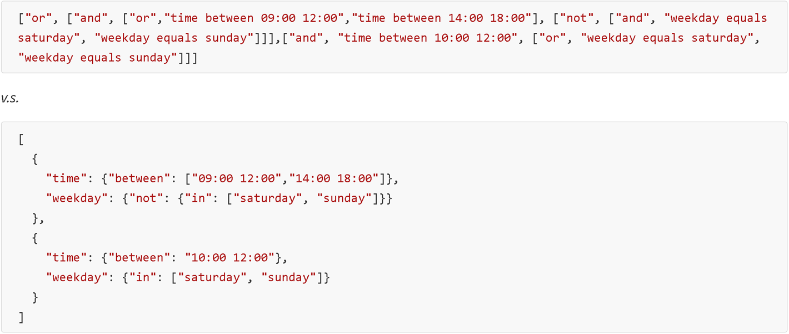

### Comparison Evaluation

In this section, PoliTHINK and JACPoL Policy Engines are compared.  We summarize the comparison in the table as below:


|                        | [PoliTHINK](https://github.com/reTHINK-project/dev-runtime-core/tree/develop/src/policy) | [JACPoL](https://github.com/reTHINK-project/dev-msg-node-nodejs/tree/master/src/main/components/policyEngine) |
| ---------------------- | :--------------------------------------: | :--------------------------------------: |
| Programming Language   |                 Javascript                  |                 Javascript                  |
| Environment            |               Runtime Core and Messaging Node               |              Messaging Node              |
| Administrative Domain  |                 End User and CSP                |                   CSP                    |
| Policy Management      |             Locally Defined              |           Remotely Maintained            |
| Policy Language Syntax |                   JSON                   |                   JSON                   |
| Architecture           |                 PDP/PEP                  |             PDP/PEP/PRP/PIP              |
| Access Control Scheme  |                   ABAC                   |                   ABAC                   |
| User Interface         |                   Yes                    |                    No                    |
| Complex Rule           |              Partly Support              |                 Support                  |
| Obligation             |                 Support                  |                 Support                  |
| Context Awareness      |                   Yes                    |                   Yes                    |
| Policy Readability     |                  Medium                  |                   High                   |
| Policy Expressiveness  |                  Medium                  |                   High                   |
| Policy Index           |              Partly Support              |                 Support                  |


As we can see, the two policy engines have the following features in common:

- Both are developed in Javascript.
- Both policy languages follow JSON syntax.
- Both employ ABAC access control scheme.
- Both support obligation and are context sensible.
- Both adopt PEP/PDP architecture.

On the other hand, they have following differences:

- The PoliTHINK was designed to be used in the runtime browser for the end user and in the backend Message Node for the CSP, while the JACPoL is limited to be used in the backend component for the CSP.
- The PoliTHINK policies are managed locally through a user web interface, while the JACPoL policies are maintained remotely in a repository.
- In addition to PDP, PEP components, the JACPoL policy engine has additional modules such as PIP and PRP.
- The JACPoL policy engine does not have a web UI.
- The PoliTHINK policy engine does not fully support complex rule or policy index, which would be illustrated further in the subsequent paragraphs.
- At last, although both use JSON syntax, the JACPoL policy language semantics is more expressive and readable than the PoliTHINK policy language.

In the following text we compare policy specification languages of the two policy engines. Please refer to here for more information about [the runtime policy language](https://github.com/reTHINK-project/specs/blob/master/policy-management/runtime/policy-specification-language.md) [5] and here for [the CSP policy language](https://github.com/reTHINK-project/dev-msg-node-nodejs/tree/master/src/main/components/policyEngine/prp/policy) [3].


**Readability.** Given the rule as below for example, we can see that for the same rule, the JACPoL policy language is more readable than the PoliTHINK policy.



**Fig. 7 - A runtime rule example (upper) and a CSP rule example (lower) to verify working hours.**


**Expressiveness.** From the above example we can see both policy language can express complex condition using logical operators (AND, OR, NOT) to combine constraints on multiple attributes. However, in addition to that, the CSP policy language also support the following semantics that the runtime policy language does not support:

```json
{"sumOf x y": {"not": {"anyOf": [
        {"between": "j k"},  
        {"equals": "z"}]}}}
```

in which the string "sumOf x y" is an *attribute condition*. The keyword *sumOf* defines a function to compute the sum of attributes *x* and *y*, which is to be evaluated by the subsequent *condition expression*. Please note that a parameter like *j, k* or *z* can also possibly be another attribute instead of an explicit value. In this sense, we can see that the CSP policy language can do more flexible examination on the attributes using various operations.


**Scalability.** Both policy languages support rule index using a *target* field to verify the applicability of a given rule. However, the PoliTHINK policy language does not include this concept for policy index, which may cause it less scalable and not efficient.
