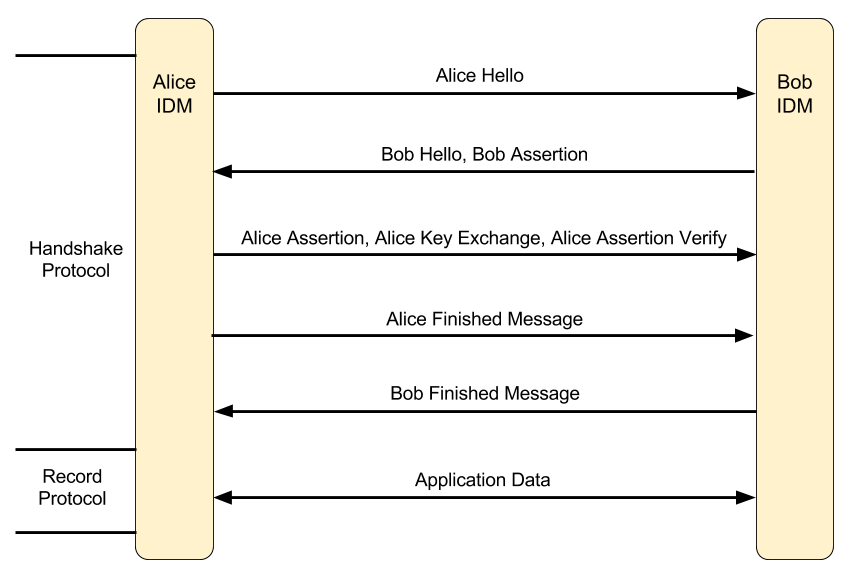
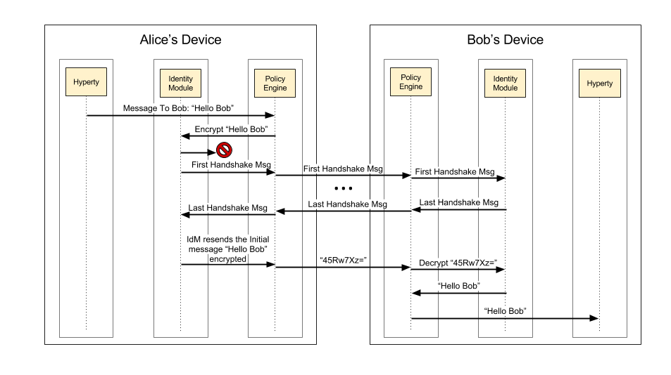

Identity management relies upon managing life-cycle of identity-related security tokens. Therefore, identity assertions are used in reTHINK to identify a user and to prove that he was authenticated on an IdP. The IdP asserts a particular content for the user, provided during the request for authentication by the IdM, after a successful authentication this same user.

reTHINK architecture is designed to operate in a peer-to-peer architecture, and as a result there is no centralised service that proceeds to authenticate the users in reTHINK. Because of that, the identity assertions play a very important role in reTHINK, by enabling mutual authentication between users: here agin reTHINK promotes ideas similar to [WebRTC working group](https://tools.ietf.org/html/draft-ietf-rtcweb-security-arch-12). Using IdP protocols like [OpenID Connect](http://openid.net/developers/specs/) it is indeed possible to request the IdP to assert a particular content on the request to authenticate the user. The identity token received after the user's successful authentication contains the user identity assertion and the content provided during the authentication request, also asserted. In reTHINK, the content to be asserted by the IdP is a public key specified by the Identity Module, later used to prove the user's identity to a third party. This way, the identity assertion provided by the IdP acts as a digital certificate, where the IdP plays the role of a Certification Authority (CA).

As such, whenever a user intends to initiate a communication with another user, the mutual authentication protocol is triggered so that users can authenticate each other mutually. In order for the mutual authentication to be successful, all the messages are required to have an identity assertion, which will work as a digital certificate. Therefore, to authenticate to a message, the sender identity assertion obtained through the IdPs is attached to the message, containing the user public key. To confirm that the public key actually corresponds to the claimed identity, the receiving user contacts the IdP to validate the content of the Identity assertion. With this public key, the receiver can validate the sender message digital signature and encrypt the response to the sender challenge to conclude and successfully authenticate the sender identity. For mutual authentication, the roles invert and the receiving users becomes the one who must prove his identity, using the same procedure. For user privacy assurance, the Identity Module may frequently request the generation of a new Identity assertions, each with different public keys.

Taking the mutual authentication process described above, the IdM performs this authentication process and along with it, generates the symmetric session keys to be used for the protection of the messages exchanged after the mutual authentication process. This is done in an identical manner as in the TLS protocol. By doing this, we provide the same procedures and the same security properties of the TLS, including the security assurance for the message integrity and confidentiality. The proposed solution used in rethink for authentication is also separated in the handshake and record phases. Some simplifications are introduced in the authentication protocol compared to TLS, mainly because there is no need to support some of the features. The negotiation steps of cryptographic methods in TLS are not taken in consideration since it is the Identity Module that defines the cryptographic methods to be used, and all devices running the reTHINK application will use the same version of the Identity Module. Additionally, compression will not be considered, since this protocol is already running on top another TLS communication (i.e. the communication of each client with the Message Node).

The figure above  illustrates all the messages exchanged to provide  mutual authentication between the users Alice and Bob. The following provides an explanation of the overview on the developed mutual authentication flow.

 - **Alice Hello**: This message contains a number generated randomly by Alice.

 - **Bob Hello, Bob Assertion**: This message contains a random number generated randomly by Bob and his identity assertion with his public key.

 - **Alice Assertion, Alice Key Exchange, Alice Assertion Verify**: In case Alice is not in anonymous mode, she sends her identity assertion with her public key and sends a randomly generated premaster key encrypted with Bob's public key. In case Alice identity assertion is sent, the assertion verification must also be sent in the message to prove the ownership of the public key. This verification consists in the signature of the hash of all the previous messages exchanged and the content of this message.

     In this phase both Alice and Bob generate a master key using the premaster key and both random values exchanged in the beginning. With the master key the following keys are computed: Alice's MAC Key, Bob's MAC Key, Alice's encryption Key, Bob's encryption Key.

 - **Alice Finished Message**: This is the first message to use the keys generated previously, and contains the MAC from the result of a pseudo random function that receives the master secret and all the handshakes messages exchanged previously as argument. This result is also encrypted with the Alice's encryption key.
 - **Bob Finished Message**: This message is the response to the Alice finished message. It uses the keys generated previously to generate a MAC and encrypt that value. The MAC is obtained from the result of a pseudo random function that receives the master secret and all the handshakes messages exchanged previously as argument. This result is also encrypted with the Bob's encryption key.

    In this phase the authentication or mutual authentication is complete with all the necessary keys generated. This symmetric key allows for a secure communication between two users.

- **Application Data**: This message contains the body of the message encrypted with the encryption key of the sender to grant confidentiality, and a MAC of the entire message with the sender's MAC key to grant integrity.

_NB. Despite the emphasis of the protocol developed for the IdM being in the mutual authentication it also supports anonymous communication, where the user who initiates the call starts it in anonymous mode. The only difference in the protocol flow is that the user who starts the communications does not send his identity assertion, not allowing the user who receives the request for communication to verify the caller's identity. The decision of accepting or not the anonymous communication rests with the policy engine._

##### When does the mutual authentication occur?

The mutual authentication protocol is mandatory so that a secure communication channel can be established. Whenever some user intends to start a communication with another user the mutual authentication protocol must be triggered. The mutual authentication can start in two situations: when a message from a Hyperty URL to a Hyperty URL is sent for the first time between those Hyperties, and when an IdM method is called to explicitly start a mutual authentication between two Hyperties URLs.

The IdM method that triggers the mutual authentication protocol is called in a specific case, being when the Policy Engine receives a request to accept a subscription to a group chat, or when the current user invites another user to subscribe his Data Object.

Regarding the activation triggered by sending a message for a Hyperty for the first time, the Figure below illustrates the message flow for the first message sent between two Hyperties, one from Alice and one from Bob sent via the Message Bus. Only the essential components to demonstrate the flow are illustrated, which in this case are the Hyperty, the Identity Module (IdM) and the Policy Engine (PE). It is assumed that all messages sent via the Message Bus are intercepted by the Policy Engine, in order to be filtered according to the defined policies.

Taking data flow as an example, Alice starts by sending for the first time, the message "Hello Bob" to Bob. The PE intercepts the message and sends it to the IdM, to encrypt the message. The IdM tries to find the cryptographic keys generated for the secure communication between Alice and Bob. Since it is the first communication between Alice and Bob no cryptographic keys exists and the identity of Bob has not yet been authenticated. In this case, the IdM suspends the transmission of that message and starts immediately the mutual authentication protocol.

After receiving the last message of the handshake protocol and if Bob's identity is verified, Alice's IdM unblocks the initial message that triggered the mutual authentication protocol. However, the message is now sent encrypted with her symmetric key and with the integrity of the message protected by adding the hash of the message. This message is forward to the Bob's device and is intercepted by the PE, which requests Bob's IdM to decrypt the message and verify the hash. The IdM then uses Alice's symmetric keys to decrypt and verify the hash of the message, and passes the message with the original value "Hello Bob" sent by Alice. To conclude, the PE receives the message, decrypted and validated, and forwards it to the destination Hyperty.
