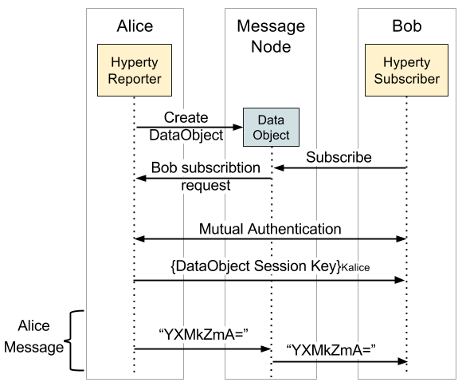

The reTHINK framework provides support for two types of communication, a direct communication between two users through their respective Hyperties and the Reporter - Observer communication, using Data Objects, where messages are broadcasted to all  authorized Hyperties. The encryption of these communications is optional, depending on the user preferences regarding secure channels. This secure channel consists on the creation of a HMAC of the message followed by the encryption of the message, to ensure confidentiality and integrity.

 To implement the secure channel on a direct communication between two Hyperties, the Identity Module needs to capture these messages, in order to secure the contents of the messages exchanged. Using Figure 5 as an example of a secure communication between Alice and Bob, when Alice sends a message through her Hyperty, this message is intercepted by the Policy Engine, since all messages passe by it. The Policy Engine sends that message to the Identity Module, to be encrypted with Alice's session key and authenticated with the Alice MAC's key, with these two keys generated during the mutual authentication process. After the message manipulation, the Identity Module returns the message to the Policy Engine, to be sent to the public Message Node. The Message Node then forwards the message to the Bob device, where the Policy Engine running in the Bob device, intercepts it and applies the same steps used in the protection phase, but in this time to decrypt the message. After the Policy Engine receives the decrypted message by the Identity Module, returns it to the Hyperty of Bob in plaintext. When Bob sends a message, the same flow is used, with the only difference being in the key used to encrypt and to authenticate, which in this case uses the set keys of Bob.

In a group chat communication, the communication starts with the creation of a Data Object by the Hyperty Reporter and the subscription from other Hyperties to that Data Object. After that, when a Hyperty sends a message, it is broadcasted to all Hyperties subscribed. The encryption of these messages is optional, but in case of opting to use a secure channel, these messages are encrypted with a symmetric key shared by all participants in the group chat.

The Hyperty reporter, in a group chat, is responsible for managing the session key and the authentication of others Hyperties that join that chat group. Following the creation of a Data Object by the reporter, he generates a symmetric key and associates it to the Data Object. As illustrated in the Figure below, after the creation of the Data Object, when a Hyperty makes a request for subscription, this request is forward to the reporter, which starts the mutual authentication between the reporter and that subscriber. When the authentication is completed with success, the reporter encrypts the symmetric key associated to the Data Object with the reporter session key, obtained through the mutual authentication process and shared by both Hyperties reporter and subscriber. After that, the subscriber has the key which allows him to decrypt all messages exchanged. In the end, all Hyperties that successfully subscribe the same Data Object will end with the same symmetric key for that session.

