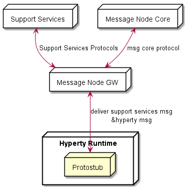

Message Node and Protostubs Development
---------------------------------------

### Overview

The protocol stubs (AKA protostub) play a central role in the [protocol on-the-fly concept](hyperty-messaging-framework.md#protocol-on-the-fly-protofly-and-protostubs). A stub is the piece of code that a reTHINK runtime downloads, instantiates and executes on-the-fly in order to exchange messages with a backend system from a foreign or even from the own domain. From the runtime's point of view the stub is the required "glue" between the reTHINK Message Model and the backend domain's protocols. The stub implements a well defined interface for the bi-directional asynchronous exchange of messages and hides all potential complexity of protocol translations for the interoperability with the backend domain.

The communication endpoint of a stub in a domains backend is the Messaging Node (MN). The MN and the stub build a unit that shall be designed and implemented together. The implementor of a protocol stub and the corresponding MN has to take some decisions:

1. is the Message Node able to route native reTHINK JSON Messages and no protocol translation is required in the protostub?
2. is it possible to add with a reasonable effort, Message address allocation and Subscription Management support services functionalities as well as required connectors to interact with reTHINK back end services (including Domain Registry, Global Registry and Identity Management support services) to the Message Node?

If answers to above questions are yes, probably the most appropriate Message Node topology is the standalone message node model where all functionalities are provided by a single message node service and its associated protostub. This topology is used by [Vertx Message Node](https://github.com/reTHINK-project/dev-msg-node-vertx) and [NodeJS Message Node](https://github.com/reTHINK-project/dev-msg-node-nodejs).


If answer to question 1 is negative, the potential complexity to be placed in the stub itself should be evaluated: Shall the stub do everything that is necessary to translate the protocol to the backend domains specifics? Or shall the stub just forward messages and let the MN perform the major tasks of the protocol translations? These are some hints that the developer should take into account:

3.	Does the stub have dependencies to additional libraries? This might blow up the size of the stub and may complicate its deployment. Perhaps there is a chance to avoid some external dependencies?
4.	Do any parts of the stub and it's dependencies underlie special restricting licenses or do they contain code that holds intellectual properties that shall be protected? Since the code is downloaded to an unknown, "strange" environment this might be an issue.
5.	How many resources (network, processing, memory etc.) does the stub require? Are these requirements compatible with all addressed runtime platforms?

These questions shall be kept in mind, when the design decisions for a stub/MN couple are made. If one of the above questions can be answered with yes, then it might perhaps be an option to implement a basic stub that uses a simple connection mechanism like a WebSocket or similar to forward the reTHINK messages directly to the MN. In this case the MN itself would be responsible for the required protocol translations on the server side for its domain.

An example for such a situation is the [Matrix.org based MN](https://github.com/reTHINK-project/dev-msg-node-matrix) and its stub. The decision was made to let the stub just forward reTHINK messages and therefore keep it simple and small. The implementation of the Matrix.org client logic was done on the MN side. If the stub had implemented a full Matrix.org client, there would have been a set of dependent SDK-libraries with their own set of dependencies each. Furthermore a Matrix.org client produces additional overhead traffic that should be restricted to the MN internal system and therefore be kept away from the runtime device.



Another aspect to be taken into account is whether the Message Node is based on an existing Messaging solution that is already in production (e.g. core IMS, cloud messaging like pubnub, firebase, etc). In this case Messaging Node specific functionalities (allocation manager, subscription manager, registry connector) can be provided by a separated Support Service server, while Hyperty messages are delivered to the messaging core. This means, the protostub would handle two different protocols connections as shown below.


### Messaging Model

#### General message format

A reTHINK message is a standard JSON Object with a fixed set of header fields and a variable message body. These are the common header fields:

| name | type                                                                                                          | description                                                                                                                                                                                                                  |
|------|---------------------------------------------------------------------------------------------------------------|------------------------------------------------------------------------------------------------------------------------------------------------------------------------------------------------------------------------------|
| id   | numeric                                                                                                       | an identifier used to associate RESPONSE messages to the initial REQUEST message. It should be noted that the REQUEST.id MUST be incremented every time a new REQUEST message is created.                                    |
| from | [URL](https://github.com/reTHINK-project/dev-service-framework/blob/develop/docs/datamodel/address/readme.md) | URL of a Hyperty instance or user associated with it                                                                                                                                                                         |
| to   | [URL](https://github.com/reTHINK-project/dev-service-framework/blob/develop/docs/datamodel/address/readme.md) | One or more [URLs](https://github.com/reTHINK-project/dev-service-framework/blob/develop/docs/datamodel/address/readme.md) of Message recipients. According to the URL scheme it may be treated in different ways by the MN. |
| body | JSON-Object                                                                                                   | The message body according to the type that is identified by the type attribute in the message header.                                                                                                                       |

#### Message Body

The Message Body is a JSON object that varies according to the message type, specified in the message header. Currently following types of Message bodies are specified in the reTHINK specification:

-	CreateMessageBody
-	ReadMessageBody
-	UpdateMessageBody
-	DeleteMessageBody
-	ForwardMessageBody
-	ResponseMessageBody
- SubscribeMessageBody
- UnsubscribeMessageBody
- ExecuteMessageBody


Message bodies can contain JWT tokens for Access Control or for Identity Assertion purposes. See [here](../specs/dynamic-view/identity-management/user-identity-assertion.md) for more details.

The "MessageBody.via" attribute contains a list of all Protostub addresses (Protostub) that the message has been passed through. It is used to prevent infinite cycles in the Hyperty Messaging Framework.

Detailed specifications of these Message bodies can be found at [Message Model](../datamodel/message/readme.md).

#### Request - Response transactions

A Response to a Request message should follow this rule:

```
Response.from = Request.to
Response.to = Request.from
Response.id = Request.id
```

The Request.id MUST be incremented every time a new Request message is created.

### APIs
#### The ProtoStub API

#### The ProtoStub API

The interface that a protocol stub has to implement is kept very small and simple by intent.

A protocolStub is constructed with a set of parameters that ensures that the stub can be uniquely identified, can connect to its backend Messaging Node and can communicate with the messaging bus in the runtime.

```
new ProtoStub(runtimeProtoStubURL, busPostMessage, configuration)
```

*Parameters:*

| name                | type                                      | description                                                                                                                                                                           |
|---------------------|-------------------------------------------|---------------------------------------------------------------------------------------------------------------------------------------------------------------------------------------|
| runtimeProtoStubURL | URL.RuntimeURL                            | A URL allocated by the runtime that uniquely identifies this protocolStub.                                                                                                            |
| busPostMessage      | Message.Message (???)                     | The runtime BUS postMessage function to be invoked on messages received by the protocol stub.                                                                                         |
| configuration       | ProtoStubDescriptor.ConfigurationDataList | Configuration data that is retrieved from the protocolStub descriptor. This data is implementation-specific and ensures that the Stub can address and connect its own Messaging Node. |

##### Methods

The connect method establishes the connection between the protocol stub and the backend messaging node.

`connect(identity)`

**Note:** The "connect" method will not be directly invoked by the runtime implementation. Rather it is expected that the stub maintains its connection state internally. Whenever the runtime intents to send a message via the postMessage method, the stub shall auto-connect to the Messaging Node and attempt to keep this connection open until it explicitly receives a "disconnect" invocation.

*Parameters:*

| name     | type    | description                                                                                                         |
|----------|---------|---------------------------------------------------------------------------------------------------------------------|
| identity | IDToken | An optional identity token that can be used to authenticate this stub connection against the backend messaging node |

The disconnect method is used to explicitly disconnect a stub from its messaging node. Such a disconnect can be used to release and clean up resources in the stub and also on the backend side in the messaging node.

`disconnect()`

The postMessage method is used by the runtime to send messages through the protocol stub to connected backend server.`
postMessage(message)
`

| name    | type            | description                                        |
|---------|-----------------|----------------------------------------------------|
| message | Message.Message | The message to be dispatched by the protocol stub. |

##### Events

A protocol stub emits events to communicate its own connection state to the runtime. Whenever the stub gets connected or disconnected, it uses the "busPostMessage" to send a message to the runtimes message bus. These Event messages are defined as follows:

```
{
  "type": 'update',
  "from": runtimeProtoStubURL,
  "to": runtimeProtoStubURL + '/status',
  "body": {
    "value": "connected|disconnected"
}
```

The runtimeProtoStubURL is the URL that was provided as first parameter of the Stub constructor. The value in the message body is either "connected" or "disconnected".

### Message Node functionalities and main procedures

#### Stub identification and resource management

The MN is the connectivity endpoint for stubs that are deployed in several runtimes. From the viewpoint of the MN, each stub represents one runtime. It is the task of the MN to identify a stub connection, and to manage the life-cycle of the assigned server side resources. The actual "handshake mechanisms" between the stub and the MN are left implementation specific.

A valid method for the MN to identify a stub connection is to use the "runtimeURL", which each stub is constructed with in the runtime. If the stub provides this url during the connection handshake procedure, then the MN can identify the stub/runtime, even after a potential re-connect, e.g. due to temporary loss of network connectivity.

It is the responsibility of the MN to release resources if the "disconnect" method was invoked on the stub . This is the official indication that the runtime does not need this stub connection anymore and it has released the stub. In the alternative case, that a stub was not sending messages for a longer period, but was also not officially disconnected, it is up to the MN implementation to run a kind of garbage collection mechanism to release stale resources.

**TODO:** Verify identity parameter of the "connect" method.

#### Address Allocation

As soon as an entity in a runtime wants to be accessible from another runtime, this entity must be addressable. Since a MN is the central message routing point for a domain it is the MNs task to create these addresses and to assign them to the requesting runtime. The resulting internal allocation table stores the relation of the allocated addresses to the stub connections and enables a proper routing of messages between the runtimes.

The MN must support address allocation for Hyperties as well as for data object. The general format of an allocation message is as follows:

```
"id" : "<1>"
"type" : "CREATE",
"from" : "hyperty-runtime://<sp-domain>/<runtime-instance-identifier>/registry/allocation",
"to" : "domain://msg-node.<sp-domain>/<type>-address-allocation",
"body" : { "scheme" : <scheme>, "childrenResources" : [{"<resource-children-name>"}], "value" : {"number" : <integer> ,  "allocationKey" : "<key>"} }
```

where the "number" attribute stands for the number of requested addresses, the "scheme" defines the requested url scheme (or protocol) of the address and the "allocationKey" serves as identifier of this set of allocated addresses. This key can be used to identify addresses to be deleted later on.  
The MN must intercept such messages and respond with a message like:

```
"id" : "<1>"
"type" : "RESPONSE",
"from" : "domain://msg-node.<sp-domain>/<type>-address-allocation",
"to" : "hyperty-runtime://<sp-domain>/<runtime-instance-identifier>/registry/allocation",
"body" : { "code": 200, "value" : {"allocated": ["<scheme>://<sp-domain>/<identifier>", ...]} }
```

The format of the generated <identifier> part of the url is implementation specific.

The MN must de-allocate addresses, if it receives a DELETE message of this format:

```
"id" : "<3>"
"type" : "DELETE",
"from" : "hyperty-runtime://<sp-domain>/<runtime-instance-identifier>/registry/allocation",
"to" : "domain://msg-node.<sp-domain>/<type>-address-allocation",
"body" : { "resource" : "<key>" }
```

The "key" value in the body serves as an identifier of the previously allocated address(es).

For more detailed information about the allocation Messages refer to [Address allocation messages](../specs/messages/address-allocation-messages.md).

#### Interaction with the Domain Registry

The allocation of a unique address is only the first step on the way to make an entity (hyperty or data object) discoverable and usable from another runtime. In order to make it discoverable the allocated addresses must be registered in the domain registry component. The interaction with the domain registry is also the task of the MN. The MN has to intercept messages from a runtime that address the <registry> subdomain of the MNs own url and to create a corresponding asynchronous request to the domain registry. As soon as it receives an answer, the MN has to respond this answer back to the runtime.

A message to register an entity look as follows:

```
"id" : "1"
"type" : "CREATE",
"from" : "hyperty-runtime://<sp-domain>/<runtime-instance-identifier>/registry",
"to" : "domain://registry.<sp-domain>",
"body" : { "value" : <RegistryDataObject> }
```

The specification of a <RegistryDataObject> can be found [here](https://github.com/reTHINK-project/dev-service-framework/tree/master/docs/datamodeal/hyperty-registry).

If the MN receives a positive response from the domain registry, it has to respond back to the runtime with a message like this:

```
"id" : "<1>"
"type" : "RESPONSE",
"from" : "domain://registry.<sp-domain>",
"to" : "hyperty-runtime://<sp-domain>/<runtime-instance-identifier>/registry",
"body" : { "code": 200 }
```

Additional messages are defined to perform lookups of registered entities (hyperties or data objects) for a given user id. The full specification of these messages can be found here [Registration Messages](https://github.com/reTHINK-project/dev-service-framework/blob/d3.2-working-docs/docs/specs/messages/registration-messages.md)

#### Subscription management

A core concept in the reTHINK architecture is that Hyperties interact with each other by exchanging and synchronizing their managed data objects based on the [Reporter - Observer pattern](p2p-data-sync.md). The MN supports this concept by allowing observers (Hyperties, running in one or more runtimes) to subscribe for changes of certain allocated data object urls deployed in other runtimes. Whenever a Hyperty runtime reports a change in a monitored data object it sends a change message to the MN. The "to" address of this message will just be the allocated address of the updated data object, not the address of the subscribers directly.

In order to route such object change messages to the subscribed listeners, the MN has to maintain an own list of subscribers per allocated data object. Therefore the MN must intercept subscription messages which have the following format:

`"id" : "1"
"type" : "SUBSCRIBE",
"from" : "hyperty-runtime://<observer-sp-domain>/<hyperty-observer-runtime-instance-identifier>/sm",
"to" : "domain://msg-node.<observer-sp-domain>/sm",
"body" : { "resource" : "<ObjectURL>" , "childrenResources" : [{"<resource-children-name>"}], "schema" : "hyperty-catalogue://<sp-domain>/dataObjectSchema/<schema-identifier>"}
`

This message of type "SUBSCRIBE" is addressed to "domain://msg-node.<observer-sp-domain>/sm", which is the identifier of the MNs "Synch Manager (sm)" component. In the body the most important field is the "resource", which contains the allocated address of the object that shall be subscribed by the runtimes sync manager (as identified by the "from" field).

The MN must extract the <ObjectURL> from the body and assign this URL internally to the given HypertyURL contained in the "from" URL. This means for the MN that every future "changes"-message to this ObjectURL must be forwarded to the Hyperty Runtime Instance. If the "childrenResources" arrays contains values, than additional assignments must be created for each <ObjectURL> + / + <resource-children-name>.

After extraction of the parameters and the creation of the assignments, the MN must respond with a message of code 200 back to the runtime.

`
"id" : "1"
"type" : "RESPONSE",
"from" : "domain://msg-node.<observer-sp-domain>/sm",
"to" : "hyperty-runtime://<observer-sp-domain>/<hyperty-observer-runtime-instance-identifier>/sm",
"body" : { "code" : "2XX"  }
`

*NOTE:* The procedure to un-subscribe from data object changes looks very similar to the above described subscribe procedure. The message to intercept is then of type "UNSUBSCRIBE". The MN has to remove the previously mapped assignments and respond back with a code 200 message.

If the MN later on receives a message from a reporting Hyperty that its data model has changed this message will look like this:

`
"id" : "3"
"type" : "UPDATE",
"from" : "<ObjectURL>",
"to" : "<ObjectURL>/changes",
"body" : { "value" : "changed value"  }
`

Note that the "from" and "to" fields just contain the <ObjectURL> and the "to"-field has the suffix "/changes". When the MN receives such a message, it must look up for all subscribed listeners to this <ObjectURL> and forward the message to them.

A more detailed specification can be found at [Data sync messages](https://github.com/reTHINK-project/dev-service-framework/blob/d3.2-working-docs/docs/specs/messages/data-sync-messages.md).

#### Identity management connector

*To be provided*

#### Policy decisions and enforcement

Message nodes are responsible for the interaction of runtimes in their own domain with runtimes from foreign domains by offering protocol stubs to these external runtimes. However the operators of a certain domain need a mechanism to control these domain interactions and to potentially block or limit certain combinations of message exchange.

In order to achieve this, a MN must provide a hook in the message flow that allows to apply policy based decisions to the routing. These policy must be manageable by the domain Policy Manager.

#### Protocol on-the-fly engine

The basic operation mode of a MN is that it is connected by runtimes directly via the provided protocol stubs. A message received from one runtime will be forwarded to another runtime which must also be directly connected through a stub. This is a classic "triangular" messaging architecture. The triangular message flow looks like this:

`
RuntimeA --> StubB --> MN-B --> RuntimeB
`

For future iterations of the reTHINK messaging it is intended that the MNs also support a "trapezoid" architecture for inter-domain communication. In contrast to the triangle, each runtime will only have a connection with the MN from its own domain. If one runtime wants to send a message to another one from another domain, it will not be runtime itself that downloads and instantiates the stub of the foreign domain. It would be the domains MN instead that has to do this.

The trapezoid message flow will then look like this:

`
RuntimeA --> StubA --> MN-A --> StubB --> MN-B --> RuntimeB
`

and vice versa. This implies that in future versions the MN has to implement a module for the proper downloading, instantiation and operation of foreign stub in a sandboxed environment, just like the runtimes are already doing it.

### Message routing procedure

This section tries to summarize all the descriptions of the individual MN components from above and describe the basic messaging handling and routing procedures inside a MN. It uses a pseudo-code like format to describe the order of the operational steps.

*to be reviewed. we should separate routing of hyperty messages from management messages. See msg node topologies at the beginning*

Several checks must be applied:

-	Is it a routable reTHINK message?
	-	i.e. does it contain a "from" and "to" field?
	-	if not --> reject / ignore
	-	stop
-	To be confirmed: Identity-token verification ?
-	Is it an allocation management message?
	-	allocate / de-allocate addresses
	-	return proper RESPONSE message
	-	stop
-	Is it a registration management message?
	-	perform the requested (asynchronous) interaction with the domain registry
	-	return the result of this interaction in a proper RESPONSE message
	-	stop
-	Is it a subscription management message?
	-	extract the DataObjectURL and potential childrenResources from the message body
	-	perform the requested assignments / de-assignments to the internal subscriber mappings
	-	stop
-	Is the message type == UPDATE and the "from" address one of the previously subscribed DataObjectURLs?
	-	Is the "to" address == "from" + "/changes"?
		-	retrieve the corresponding runtime URL from the subscriber mappings
		-	forward this message to the retrieved runtime URL via the proper stub
		-	stop
-	This seems to be a "normal" message.
	-	extract the "from" address and remember its relation to the stub that has sent this message
	-	(this is required to find the correct return path for a subsequent response to this address)
	-	extract the "to" address and investigate the corresponding stub
	-	if the "to" address corresponds to a connected stub ()
		-	forward the message through this stub
	-	else
		-	(the "to" address points to a domain that is not currently connected via a stub)
		-	discover, download, instantiate and use a stub to this foreign domain (trapezoid architecture)
	-	stop

### Protostub Source Code Examples

#### Stub construction and activation

Stubs are provided by different vendors and developers and of course they have different naming conventions. In order to provide a common instantiation scheme a convention was defined additionally to the interface that ProtoStubs have to implement. The convention is that each stub modules must export a default activation function that is used by the runtimes to obtain a stub instance with a given set of parameters.

```
export default function activate(url, bus, config) {
  return {
    name: 'MatrixProtoStub',
    instance: new MatrixProtoStub(url, bus, config)
  };
}
```

This activation function hides the internal naming and just returns an object that provides an implementation of the methods defined in the ProtoStub interface. The parameters of this function correspond directly to the previously described parameters of the Stub constructor.

#### Auto connect mechanism

As mentioned as a side note in the API description of the ProtoStub's connect method, the stubs are expected to support an auto connect mechanism. This is because the runtime will not explicitely invoke the connect method itself. Instead it just sends messages via the messaging bus to the stub and assumes that the stub takes care of its own connection state.

A simple approach to implement this behavior in the stub is to maintain a flag that indicates whether the connection to the MN shall be kept open or not. This flag could be set to TRUE, as soon as the first message is being sent and to FALSE if the stub receives a "disconnect" command from the runtime. If for instance a network problem causes an interruption of the connection between stub and MN, the stub would attempt to re-connect as soon as the next message shall be sent.

This is, how the method to send a message could look like:

```
_sendWSMsg(msg) {
  if ( this._assumeOpen )
    this.connect().then( () => {
      this._ws.send(JSON.stringify(msg));
    });
}
```

If there is an explicit invocation of the "disconnect" method of the stub the stub will close the connection to the MN and set the keep alive flag off.

```
disconnect() {
  this._ws.close();
  this._assumeOpen = false;
}
```

#### Connection events

The stub must emit a "connect" or "disconnect" message to the bus whenever its connection state changes. The following method can be used to encapsulate this:

```
_sendStatus(value, reason) { let msg = { type: 'update', from: this._runtimeProtoStubURL, to: this._runtimeProtoStubURL + '/status', body: { value: value } }; if (reason) { msg.body.desc = reason; }

this._bus.postMessage(msg); }
```

The expected "value" parameter is either "connected" or "disconnected". Optionally a reason can be specified that will be placed int the body of the message.

If the connection to the MN is established via a Websocket, then the sending of the corresponding event messages can be triggered in the "open" and "close" handlers of the Websocket.

```
_onWSOpen() { this._sendStatus("connected"); }

_onWSClose() { this._sendStatus("disconnected"); }
```

#### Integration with the Messaging Bus of the Runtime

Protocol stubs are tightly integrated with the messaging bus of the runtime. This integration is bi-directional. A reference to the messaging bus is provided as second paramenter of the stub constructor.

In order to receive messages from the runtime's messaging bus, the stub has to add itself as a listener. This can be done directly in the stubs constructor by adding such a code snippet:

```
this._bus.addListener('*', (msg) => {
    this._assumeOpen = true;
    this._sendWSMsg(msg);
});
```

Whenever now the stub receives a message via this listener callback it sends it forward (in this case via a Websocke connection) to its MN.

For every message that is received from the MN, the stub forwards this message to the bus by using its postMessage method like shown here:

```
// parse msg and forward it locally to the runtimes messaging bus
_onWSMessage(msg) {
  this._bus.postMessage(JSON.parse(msg.data));
}
```
